# agent-kit

*English · [Português](README.pt-BR.md) — this file is the source of truth.*

> **agent-kit is an epistemic-discipline kit for Flutter/Dart work with Claude Code — deterministic verifiers for what the harness doesn't check, plus the reasoning postures to use them well.**

   

**How to read the map below.** The top band is entry — three ways in: a loose phrase, a `/ce-*` command, or always-on (no invocation). The rail underneath is conduction: `superpowers` owns Discover, [compound-engineering](https://github.com/EveryInc/compound-engineering-plugin) ("CE" from here on) owns Plan through Ship — both external plugins you install separately. This repo (`/core:*`, `/team:*`) is the always-on floor under either conductor.

<picture>
  <source media="(prefers-color-scheme: dark)" srcset="assets/routing-diagram-dark.svg">
  
</picture>

*The gate behind Ship is `/core:review-local` (lint · tests · citation validation); the commit itself is `/core:commit`; capture after Ship is `/ce-compound` and `core:learn`. `/core:tech-breakdown` (dead end, dotted) never enters CE automatically — its output is copy-pasted into `/ce-plan`.*

Of everything the kit ships, **only the hooks are a guarantee**: they fire on their own; every skill, gate, and posture runs because you invoked it. Architecture, lifecycle, posture: **[docs/OPERATIONS.md](docs/OPERATIONS.md)**.

## What's included

Four plugins installable via a local marketplace. `mobile` is the flagship vertical; `core` and `council` are the stack-agnostic foundation under it.

| Plugin | What it is | Install when |
|---|---|---|
| `mobile` — **flagship** | Flutter/Dart toolkit: review rules, scaffolding, four deterministic verifiers (one blocking smell-checker + three advisory hooks) | Flutter/Dart project on (or near) the assumed stack — note below |
| `core` | Deterministic mechanism: read-ledger and citation gate, the always-on discipline rules, `core:grill-me`'s checkpoints (`pre-plan`/`post-plan`/`pre-done`), the repo gates | Always — the foundation for the rest |
| `council` | Epistemic lenses (reasoning postures) for high-cost-to-reverse decisions | Recommended with `core` |
| `team` | Copilot for agile ceremonies — refinement with the PO, squad communication | You run refinement or write to a squad |

**The `mobile` stack assumption.** Verifiers are calibrated to MobX + `get_it`/`injectable` (scaffolding also assumes `dartz`). On Bloc/Riverpod the DI and lifecycle checks simply don't fire — they look for `get_it` calls inside `_store.dart`/`_controller.dart`. No false positives, but no coverage either, until you edit the hook regexes yourself.

Full catalog of every skill, agent, hook, script: browse `plugins/*/skills`, `plugins/*/agents`, `plugins/*/hooks`.

## Requirements

Severity of each dependency — what you'll actually observe if it's missing, not just whether it's "recommended."

| Dependency | Severity | Symptom if missing |
|---|---|---|
| [Claude Code](https://claude.com/claude-code) with plugin support | **hard** | nothing works — no `claude plugin` commands, no hooks, no skills |
| `superpowers` + `compound-engineering` (external plugins, own marketplaces) | **assumed-by-routing** | the "Which tool, when" table below references `/ce-*` and `superpowers:*` skills that don't resolve; `scripts/doctor.sh` reports this as `INFO`, not a failure |
| `pr-review-toolkit` (external plugin, generic marketplace) | **degrades** | `/core:review-local` falls back to `/core:review-remote` — no citation gate, no parallel dispatch (full cost: [docs/INSTALL.md](docs/INSTALL.md#requirements--detail)) |
| A Flutter/Dart project, for `mobile` | **degrades** | `mobile`'s verifiers never fire — no DI/lifecycle/codegen checks |

## Installation

**Three ways in — pick one:**

| Path | Pick it when | Where |
|---|---|---|
| Profile script (`scripts/install.sh`) | you're on Claude Code — most people | below |
| Native `claude plugin` commands | you want to see/control each install step | [docs/INSTALL.md](docs/INSTALL.md#native-install-commands) |
| **Not on Claude Code** (Copilot, Cursor, ...) | you still want the epistemic tier | [docs/INSTALL.md](docs/INSTALL.md#use-the-epistemic-tier-on-another-ai-tool) — emits `AGENTS.md` |

### 1. Clone (once)

```bash
git clone <this-repo-url> ~/dev/agent-kit
```

### 2. Install — one line, by profile

Run it **from inside the project where the kit should be active** (scope detail: [docs/INSTALL.md](docs/INSTALL.md#native-install-commands)).

```bash
~/dev/agent-kit/scripts/install.sh minimal   # or: mobile · team · full
```

| Profile | Plugins | Pick it when |
|---|---|---|
| `minimal` | core + council | any project — the foundation |
| `mobile` | minimal + mobile | Flutter/Dart project on the assumed stack |
| `team` | minimal + team | you run refinement / talk to a squad — needs a board MCP you supply |
| `full` | all four | everything above applies |

Installs only this kit's four plugins — `superpowers`, `compound-engineering`, `pr-review-toolkit` are separate marketplaces: commands and per-plugin cost in [docs/INSTALL.md](docs/INSTALL.md#external-plugins).

### 3. Verify, and update later

```bash
~/dev/agent-kit/scripts/doctor.sh   # checks CLI, marketplace, plugins, and the kit's own gates
claude plugin list                  # or manually: should list what you installed

# after a new commit to the kit — session restart required
claude plugin update core@agent-kit council@agent-kit team@agent-kit mobile@agent-kit
```

`doctor.sh` prints the exact install command for anything missing (CLI, marketplace, plugin, or routing's external plugins); `core`'s rules arrive via SessionStart — nothing to type. **Maintaining?** `--maintainer` runs all five gate commands (ceiling, provenance, manifest, evals, README pair) — full gate detail: [docs/OPERATIONS.md](docs/OPERATIONS.md) §4. Native commands / `AGENTS.md` / uninstall: **[docs/INSTALL.md](docs/INSTALL.md)**.

## Which tool, when

Indexed by the situation you're in, not by plugin. **The boundary convention:** loose phrase → `superpowers`; slash command → CE — syntax elects, not pattern-matching. Neither plugin enforces this: both loops stay model-invocable, so the always-on tier (`core:using-agent-kit`) is what restates the boundary. No kit skill routes you stage to stage (why: `CHANGELOG.md`'s "CE adopted as flow conductor" decision record) — the table is the whole map.

| Situation | You say/type | What fires | Owner |
|---|---|---|---|
| Vague feature idea | loose phrase ("let's think about X") | `superpowers:brainstorming` | superpowers |
| Ticket for new/changed behavior | `/core:tech-breakdown <TICKET>` | ticket→plan seam | kit |
| Something broken | loose phrase, or `/ce-debug` | `superpowers:systematic-debugging` \| CE's diagnosis loop | superpowers \| CE |
| Touching Flutter code | nothing — fires automatically | smell-checker (blocking) + 3 advisory hooks | kit (mobile) |
| Decision expensive to undo | wear a `council` posture | reasoning layer (postures — `plugins/council/`) | council |
| About to say it's done | `/core:grill-me pre-done` | blind pre-done reviewer | kit |
| Work split into independent legs | (none, or dispatch agents) | `superpowers:dispatching-parallel-agents` | superpowers |
| Running refinement / writing to squad | `/team:refine-live` \| `/team:refine-async` \| `team:chat-draft` | board-driven refinement / chat draft | team |
| About to commit / want review | `/core:review-local` and/or `/ce-code-review` | gate (lint, tests, citations) / judgment pass | kit / CE |

### "I have a vague feature idea"

**Discriminator: new behavior, not yet specified.** Say it loose — "let's think about X" — and `superpowers:brainstorming` fires: interrogation one question at a time, 2–3 candidate approaches, and a committed spec at `docs/superpowers/specs/<date>-<topic>-design.md`. From there, `/ce-plan <that spec path>` — always with the explicit path, since CE's planner auto-discovers only its own artifacts (plus legacy `docs/brainstorms/*-requirements.md`) and a superpowers spec matches neither; a bare `/ce-plan` plans from the wrong input. Once a plan exists, pick one executor: `/ce-work` and superpowers' execution flow can both implement it, and giving it to both leaves neither accountable for "done."

### "I have a ticket"

**Discriminator: the ticket asks for new or changed behavior** — a ticket *reporting a bug* goes to the next section instead, whatever tracker it lives in; the discriminator is what it asks for, not its source format.

Type `/core:tech-breakdown <TICKET>`. CE's planner builds from plans and briefs, never from a ticket, so this skill owns the ticket→plan seam: fetches the ticket, runs discovery, generates the plan, runs a critic phase against the real codebase, and writes the plan path back as a comment.

The seam is narrower than "the kit reads trackers and CE doesn't" — CE does read them, just not to start a plan from one (`ce-debug` fetches a referenced GitHub/Linear/Jira issue; `ce-sweep` reads issues through `gh`). Note the asymmetry — this is the one path that does **not** route through CE.

At review time, pass `--ticket <TICKET>` to `/core:review-local` so the `consumer-simulation` agent joins the panel — it gets only the ticket text and acceptance criteria, never the diff, so it can notice what the implementation quietly dropped. `/core:review-remote` also accepts `--ticket`, but only compares inline, with no agent.

### "Something is broken"

**Discriminator: existing behavior misbehaving,** not new behavior wanted. Say it loose — "this test started failing" — and `superpowers:systematic-debugging` fires; type `/ce-debug` for CE's diagnosis loop instead — syntax decides, since both claim the same utterances.

### "I'm touching Flutter code"

**Discriminator: the file being edited is Dart/Flutter** — this is the vertical, and it fires regardless of who's conducting. The smell-checker **blocks** an edit that adds a Dart correctness smell (DI resolved inside a store/controller, BuildContext/navigation in a store, `print()`/`debugPrint()` in production code) — add-only, so legacy files stay editable. Three advisory hooks warn without blocking: codegen staleness, DI mismatch (an `@injectable` class missing from the generated config), and lifecycle (a disposable resource with no `dispose()`). On-demand skills: full list under `plugins/mobile/skills/`. CE has zero Flutter coverage — the vertical is entirely the kit's.

### "I'm about to make a decision that's expensive to undo"

**Discriminator: the decision is costly to reverse.** Wear a `council` posture — a reasoning layer, not a flow layer, so it composes with any conductor.

Six postures, each with its own question and "wear it when" — cataloged under `plugins/council/`, indexed in `council:council`. One posture per decision is the default; escalation to blind mode (`epistemic-council`, an isolated subagent that never sees the thread's lean) has its own criteria. CE's `ce-pov` overlaps only Sagan and Maxwell, partially; the other four have no counterpart.

### "I'm about to say it's done"

**Discriminator: you're about to claim done, not mid-work.** `/core:grill-me pre-done`. A blind reviewer gets the diff, the acceptance criteria, the rule-file paths, and the plan's `session-settled:` decision entries if it carries any — never the session's narrative — and its findings go through the citation gate before you see them. If what needs pressing is a *decision you own* rather than an artifact, bare `core:grill-me` is the interview mode.

### "The work just split into independent legs"

**Discriminator: 3+ legs with no shared state.** Parallel research, generation, audit — go to `superpowers:dispatching-parallel-agents` (or native parallel subagents) instead of one long sequential pass.

### "I'm running refinement or writing to the squad"

**Discriminator: the task is ceremony/comms, not implementation.** `/team:refine-live` (PO in the room), `/team:refine-async` (from the board), `team:chat-draft` (pt-BR message for Teams/Slack). Both refines expect a board/kanban MCP this kit does not ship, and fail differently without one: `refine-async` degrades gracefully on both ends (works from a pasted context summary if `refine-live`'s state file is missing, exports subtasks as text if the board call fails); `refine-live` has no fallback — it cannot get past fetching the card.

### "I'm about to commit / I want review"

**Discriminator: the change is about to leave your hands.** The two reviews compose: `/core:review-local` is the gate — it blocks before spending a review token if lint or tests fail, then validates every citation against the read-ledger — and `/ce-code-review` is the judgment pass on top. Cite only what you read via `Read`/`Grep`: the ledger is event-driven off those two tools, so reads via `Bash` (`cat`, `sed`, shell `grep`) never enter it and break a reviewer's own citations at the gate. Unverified ≠ fabricated: a citation overlapping nothing read lands in its own "Unverified" section as a hypothesis, and a missing or session-mismatched ledger reports "nothing to verify against" — never proof of fabrication.

Once it passes, capture runs twice, on purpose: `/ce-compound` writes the repo-local learning doc (committed, shared); `core:learn` writes personal cross-session memory. `ce-compound`'s scan folds in auto-memory as lower-priority context — run `core:learn` first if you want that.

---

[docs/INSTALL.md](docs/INSTALL.md) · [docs/OPERATIONS.md](docs/OPERATIONS.md) · [CHANGELOG.md](CHANGELOG.md)
