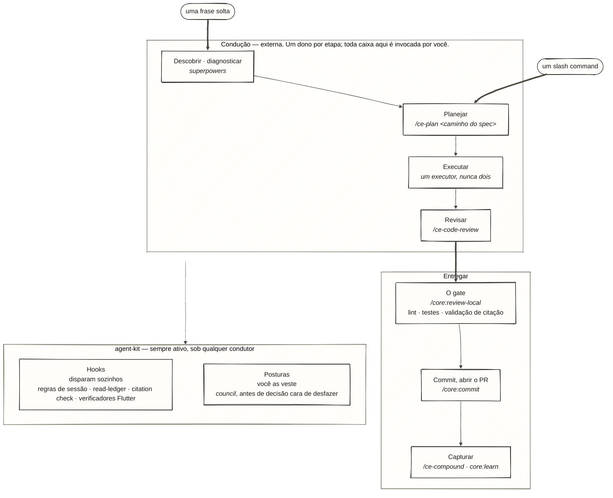

# agent-kit

*[English](README.md) · Português — o arquivo em inglês é a fonte de verdade; esta tradução o segue.*

> **agent-kit é um kit de disciplina epistêmica para trabalho Flutter/Dart com Claude Code — verificadores determinísticos para o que o harness não checa, mais as posturas de raciocínio para usá-los bem.**

**Como ler o mapa abaixo.** Este repo é a banda de baixo, e os comandos dele são `/core:*` e `/team:*`. Tudo acima pertence a dois plugins externos que você instala à parte: `/ce-*` é o [compound-engineering](https://github.com/EveryInc/compound-engineering-plugin) ("CE" daqui pra frente), e o lado da frase solta é o [superpowers](https://github.com/obra/superpowers).



Conduzir e descobrir não são trabalho do kit — CE e `superpowers` são donos disso, ou o seu próprio processo. De tudo que o kit entrega, **só os hooks são garantia**: disparam sozinhos. Toda skill, gate e postura roda porque você invocou. Arquitetura (3 camadas) e postura: **[docs/GOVERNANCE.md](docs/GOVERNANCE.md)**.

## O que vem junto

Quatro plugins instaláveis por um marketplace local. `mobile` é a vertical carro-chefe; `core` e `council` são a fundação agnóstica de stack embaixo dela.

| Plugin | O que é | Instale quando |
|---|---|---|
| `mobile` — **carro-chefe** | Toolkit Flutter/Dart: regras de review, scaffolding, quatro verificadores determinísticos (um smell-checker bloqueante + três hooks consultivos) | Projeto Flutter/Dart na (ou perto da) stack assumida — nota abaixo |
| `core` | Mecanismo determinístico: read-ledger e citation gate, as regras de disciplina sempre-ativas, os checkpoints do `core:grill-me` (`pre-plan`/`post-plan`/`pre-done`), os gates do repo | Sempre — é a fundação do resto |
| `council` | Lentes epistêmicas (posturas de raciocínio) para decisões caras de reverter | Recomendado junto com `core` |
| `team` | Copiloto de cerimônias ágeis — refinement com o PO, comunicação com a squad | Você conduz refinement ou escreve pra squad |

**A stack que `mobile` assume.** Os verificadores são calibrados pra MobX + `get_it`/`injectable` (o scaffolding também assume `dartz`). Em Bloc/Riverpod os checks de DI e lifecycle simplesmente não disparam — eles procuram chamadas de `get_it` dentro de `_store.dart`/`_controller.dart`. Sem falso positivo, mas também sem cobertura, até você mesmo editar os regexes dos hooks.

Catálogo gerado completo de toda skill, agente, hook e script: **[INVENTORY.md](INVENTORY.md)**.

## Instalação

### 1. Clone (uma vez)

Já tem um clone, em qualquer caminho, de qualquer origem? Pule pro passo 2 — todo comando abaixo usa `~/dev/agent-kit` como placeholder; substitua pelo seu caminho real.

```bash
git clone <this-repo-url> ~/dev/agent-kit
```

### 2. Instale — uma linha, por perfil

Rode **de dentro do projeto onde o kit deve ficar ativo**. `claude plugin install` instala em escopo de usuário por padrão — todo projeto desta máquina; passe `--scope project` pra confinar a este.

```bash
~/dev/agent-kit/scripts/install.sh minimal   # ou: mobile · team · full
```

| Perfil | Plugins | Escolha quando |
|---|---|---|
| `minimal` | core + council | qualquer projeto — a fundação |
| `mobile` | minimal + mobile | projeto Flutter/Dart na stack assumida |
| `team` | minimal + team | você conduz refinement / fala com uma squad — precisa de um MCP de board que você traz |
| `full` | os quatro | tudo acima se aplica |

Prefere os comandos nativos? É exatamente o que o script embrulha:

```bash
claude plugin marketplace add "$HOME/dev/agent-kit"
claude plugin install core@agent-kit
claude plugin install council@agent-kit  # recommended with core
claude plugin install team@agent-kit     # optional: agile ceremonies with PO/squad
claude plugin install mobile@agent-kit   # only in a Flutter/Dart project
```

**Três plugins externos, nenhum instalado por perfil algum.** Os gates e hooks do kit funcionam sem mais nada instalado — pule isto se é só o que você quer. Mas o roteamento abaixo assume CE e `superpowers`; sem eles, `/ce-plan`, `/ce-work` e `superpowers:brainstorming` não existem ainda. O terceiro, `pr-review-toolkit`, é o que libera o `/core:review-local` — este repo não fixa uma origem pra ele (é um plugin genérico de marketplace), então instale de onde você o obtiver; veja [Requisitos](#requisitos) pro que exatamente se perde sem ele.

```bash
claude plugin marketplace add https://github.com/obra/superpowers
claude plugin install superpowers@superpowers-dev

claude plugin marketplace add https://github.com/EveryInc/compound-engineering-plugin
claude plugin install compound-engineering@compound-engineering-plugin
```

### 3. Verifique, e atualize depois

```bash
~/dev/agent-kit/scripts/doctor.sh   # checks CLI, marketplace, plugins, and the kit's own gates
claude plugin list                  # or manually: should list what you installed

# after a new commit to the kit — session restart required
claude plugin update core@agent-kit council@agent-kit team@agent-kit mobile@agent-kit
```

Numa sessão nova, as regras do `core` já entram via SessionStart — nada a digitar. Plugin instalado em escopo de projeto precisa de `--scope project` no update também.

### Usar a camada epistêmica em outra ferramenta de IA

Os plugins são nativos do Claude Code, mas a camada epistêmica sempre-ativa é agnóstica de ferramenta. Emita como `AGENTS.md`, lido por GitHub Copilot, Cursor e outras ferramentas que honram AGENTS.md:

```bash
~/dev/agent-kit/scripts/install.sh --tool copilot --out .   # writes ./AGENTS.md
# --dry-run to preview · --force to overwrite an existing AGENTS.md
```

A imposição não viaja — hooks e skills de subagente rodam só sob Claude Code, então lá as regras são **consultivas**, e o cabeçalho emitido diz isso. A fonte de verdade continua sendo a skill `using-agent-kit` que vem no `core`; re-rode pra atualizar, nunca edite a saída à mão.

### Desinstalar

```bash
claude plugin uninstall mobile@agent-kit   # if installed
claude plugin uninstall team@agent-kit
claude plugin uninstall council@agent-kit
claude plugin uninstall core@agent-kit
claude plugin marketplace remove agent-kit
```

## Qual ferramenta, quando

Indexado pela situação em que você está, não por plugin.

**A convenção de fronteira.** Frase solta → `superpowers`; slash command → CE. Os dois implementam quase o mesmo loop, então nada impede mecanicamente uma frase solta de cair na skill model-invocable do outro lado — a convenção move a eleição de reconhecimento de padrão (indeterminado) pra sintaxe (não).

**Regras de base da cadeia do diagrama:**

- **Caminho explícito, sempre.** O planner do CE auto-descobre só os artefatos dele (mais o legado `docs/brainstorms/*-requirements.md`); um spec do superpowers em `docs/superpowers/specs/...` não casa com nenhum dos dois, então um `/ce-plan` pelado planeja a partir do input errado.
- **Um executor, escolhido uma vez.** `/ce-work` e o fluxo de execução do superpowers podem ambos implementar um plano; dar o mesmo plano pros dois deixa nenhum responsável pelo "pronto".
- **As duas revisões compõem.** `/ce-code-review` é a passada de julgamento. `/core:review-local` é o gate: bloqueia antes de gastar token de review se lint ou testes falharem (a review do CE não tem esse gate), depois valida cada citação contra o read-ledger.
- **Cite só o que você leu via `Read`/`Grep`.** O ledger é event-driven nessas duas tools; leitura via `Bash` (`cat`, `sed`, `grep` de shell) nunca entra nele, então um revisor que lê assim quebra as próprias citações no gate.
- **Não-verificado ≠ fabricado.** Uma citação que não sobrepõe nada lido cai numa seção "Unverified" própria, como hipótese. Ledger ausente ou de outra sessão é reportado como "nada contra o que verificar" — nunca como prova de fabricação.
- **A captura roda duas vezes, de propósito.** `/ce-compound` escreve o doc de aprendizado local do repo (commitado, compartilhado); `core:learn` escreve memória pessoal entre sessões. O scan do `ce-compound` incorpora a auto-memória como contexto de prioridade menor — rode `core:learn` antes se quiser isso.
- **O kit não conduz mais fluxo.** Nenhuma skill do kit te roteia de etapa em etapa. Por quê: o registro de decisão "CE adopted as flow conductor" no `CHANGELOG.md`.

### "Tenho uma ideia vaga de feature"

Diga solto — "vamos pensar em X" — e `superpowers:brainstorming` dispara: interrogatório uma pergunta por vez, 2–3 abordagens candidatas, e um spec commitado em `docs/superpowers/specs/<data>-<tema>-design.md`. Dali, `/ce-plan <caminho desse spec>` e adiante.

### "Tenho um ticket"

Pra ticket que pede comportamento novo ou alterado — ticket que *reporta bug* vai pra próxima seção, em qualquer tracker que ele viva. O discriminador é o que o ticket pede, não o formato de origem.

Digite `/core:tech-breakdown <TICKET>`. O planner do CE constrói a partir de planos e briefs, nunca de um ticket, então esta skill é dona da costura ticket→plano: busca o ticket, roda descoberta, gera o plano, roda uma fase de crítica contra o código real, e escreve o caminho do plano de volta como comentário.

A costura é mais estreita que "o kit lê trackers e o CE não" — o CE lê, só não pra começar um plano a partir de um (`ce-debug` busca uma issue de GitHub/Linear/Jira referenciada; `ce-sweep` lê issues via `gh`). Nenhum total é alegado sobre nenhum dos dois: dois plugins de terceiros em cronogramas próprios deixariam um número obsoleto rápido. E note a assimetria — este é o único caminho que **não** passa pelo CE. Se ele deveria entregar o ticket enriquecido pro `/ce-plan` é questão aberta, não design fechado.

Na hora da review, passe `--ticket <TICKET>` pro `/core:review-local` pra que o agente `consumer-simulation` entre no painel — ele recebe só o texto do ticket e os critérios de aceite, nunca o diff, então consegue notar o que a implementação deixou cair calada. `/core:review-remote` também aceita `--ticket`, mas só compara inline, sem agente.

### "Alguma coisa quebrou"

Comportamento existente se comportando mal. Diga solto — "esse teste começou a falhar" — e `superpowers:systematic-debugging` dispara; digite `/ce-debug` pro loop de diagnóstico do CE. `ce-debug` é model-invocable e reivindica as mesmas falas, então só o split solto/slash decide.

### "Estou mexendo em código Flutter"

Nada a digitar — esta é a vertical, e dispara independente de quem conduz. O smell-checker **bloqueia** uma edição que adiciona um smell de corretude Dart (DI resolvido dentro de store/controller, BuildContext/navegação em store, `print()`/`debugPrint()` em código de produção) — só em adição, então arquivos legados continuam editáveis. Três hooks consultivos avisam sem bloquear: codegen desatualizado, DI mismatch (classe `@injectable` faltando na config gerada) e lifecycle (recurso descartável sem `dispose()`). Sob demanda: `mobile:code-review-mobile`, `mobile:mobx`, `mobile:performance-patterns`, `mobile:feature-scaffold`, `mobile:marionette`, e o resto. O CE tem cobertura Flutter zero — a vertical é inteiramente do kit.

### "Vou tomar uma decisão cara de desfazer"

Vista uma postura do `council`. Posturas são camada de raciocínio, não de fluxo — compõem com qualquer condutor.

| Postura | Pergunta que ela força | Vista quando |
|---|---|---|
| `council:schrodinger` | quais explicações ainda coexistem? | um diagnóstico está ambíguo e você tenta fechar |
| `council:bohr` | a dicotomia é falsa? | uma decisão travou em "A ou B" |
| `council:epicurus` | o que aqui é excesso? | antes de dar um design ou escopo por pronto |
| `council:sagan` | isso importa, em que escala? | antes de investir esforço real |
| `maxwell` (agente — despache via a Agent tool) | como isso se propaga? | antes de tocar em algo acoplado |
| `zeno` (agente — despache via a Agent tool) | onde isso quebra? | validando uma solução proposta |

Uma postura por decisão é o default; escalar pro modo cego (`epistemic-council`, subagente isolado que nunca vê o lean da thread) tem critério próprio — o mapa é `council:council`. O `ce-pov` do CE sobrepõe só Sagan e Maxwell, parcialmente; as outras quatro não têm contraparte.

### "Vou dizer que está pronto"

`/core:grill-me pre-done`. Um revisor cego recebe o diff, os critérios de aceite, os caminhos dos arquivos de regra, e as entradas `session-settled:` do plano se ele carregar alguma — nunca a narrativa da sessão — e os achados dele passam pelo citation gate antes de chegarem a você. Se o que precisa ser pressionado é uma *decisão sua* e não um artefato, `core:grill-me` pelado é o modo entrevista.

### "O trabalho acabou de se dividir em pernas independentes"

Três ou mais pernas sem estado compartilhado — pesquisa, geração, auditoria em paralelo — vão pro `superpowers:dispatching-parallel-agents` (ou subagentes paralelos nativos) em vez de uma passada sequencial longa.

### "Estou conduzindo refinement ou escrevendo pra squad"

`/team:refine-live` (PO na sala), `/team:refine-async` (a partir do board), `team:chat-draft` (mensagem pt-BR pra Teams/Slack). Os dois refines esperam um MCP de board/kanban que este kit não entrega, e falham de formas diferentes sem um: `refine-async` degrada bem nas duas pontas (funciona a partir de um resumo de contexto colado se o arquivo de estado do `refine-live` sumiu, exporta subtarefas como texto se a chamada ao board falhar); `refine-live` não tem fallback — não passa de buscar o card.

## Requisitos

- [Claude Code](https://claude.com/claude-code) com suporte a plugins
- [superpowers](https://github.com/obra/superpowers) — dono da descoberta (brainstorming, systematic debugging, dispatch paralelo)
- [compound-engineering](https://github.com/EveryInc/compound-engineering-plugin) ("CE", MIT, testado contra 3.20.0) — dono da condução de etapas; em escopo de usuário, conduz em todo projeto desta máquina
- **`core:review-local` exige o plugin `pr-review-toolkit`** (dispatch paralelo de revisores). Sem ele o fallback é `/core:review-remote` — não um equivalente. O custo real não é perder paralelismo: é perder o citation check, a ideia mais distintiva do kit, que o `review-remote` substitui por releitura à mão que ele mesmo não chama de equivalente. Junto se perde: dispatch paralelo, e comportamento de lint/teste que difere por modo (pre-push reporta a falha como finding e continua; modo PR remoto pula lint/testes inteiro, deixando pro CI)
- Pra `mobile`: um projeto Flutter/Dart
- O kit não entrega servidor MCP nenhum. O único lugar onde ele espera um que você traz são os dois comandos de refine do `team` — um MCP de board/kanban; nada mais no kit assume nenhum

## Avançado

**Governança.** Este kit se governa com o mesmo rigor que impõe. Veja **[docs/GOVERNANCE.md](docs/GOVERNANCE.md)**: a arquitetura, a postura sobre o que é provado vs. não testado, o ciclo de vida de artefato (wired/unwired/deleted), a regra de promoção, e as convenções. Operações de quem mantém — publicação, o gate de qualidade de cinco partes, triagem de `unwired/`: **[docs/OPERATIONS.md](docs/OPERATIONS.md)**.

**Estrutura do repositório.**

| Diretório | O que é |
|---|---|
| `plugins/` | Os quatro plugins instaláveis (`core`, `council`, `team`, `mobile`) |
| `unwired/` | Material bruto genericizado esperando prova de uso — nada é carregado, custo de contexto zero ([detalhes](docs/OPERATIONS.md)) |
| `assets/` | Templates de copiar e colar: status line, esqueleto de `CLAUDE.md`, trechos de `settings.json` |
| `docs/` | [GOVERNANCE.md](docs/GOVERNANCE.md) e [OPERATIONS.md](docs/OPERATIONS.md) |
| `scripts/` | Gate de provenance, gerador de inventário, e tooling de manutenção |

---

[INVENTORY.md](INVENTORY.md) · [docs/GOVERNANCE.md](docs/GOVERNANCE.md) · [docs/OPERATIONS.md](docs/OPERATIONS.md) · [CHANGELOG.md](CHANGELOG.md)
