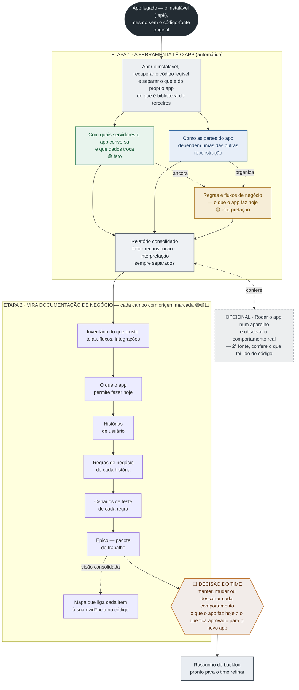

# Relatório de Engenharia Reversa de APK → User Stories
### Exemplo trabalhado do método `apk-archaeology` — App: WordPress para Android

> **⚠ Doutrina anterior.** Este exemplo precede a reestruturação *deliverable-first* (Fundação + loop por-feature; os deliverables — OpenAPI, dicionário de dados, máquinas de estado, stubs TDD — no centro, doutrina como carimbo). Ilustra a cadeia CT→RF→US, mas **não** os 6 deliverables concretos nem o spine atual — ver `references/cognitive-sequence.md`. Reescrita completa diferida.

> **Para que serve:** mapear as funcionalidades de um app concorrente ou legado direto para
> **requisitos de negócio (User Stories + critérios de aceite)**, com cada afirmação ancorada em
> evidência de código (`arquivo:linha`) e uma **banda de confiança**.
>
> **Regra de ouro:** `legacy-observed ≠ target-approved` — tudo aqui é *o que o app faz hoje*,
> **insumo para o PO decidir** manter / mudar / tirar, nunca um requisito aprovado por si só.
>
> **O que isto é:** este documento é o modelo de relatório (`modelo-relatorio.pt-BR.md`) **aplicado** à
> única rodada real do método até agora, seguindo a mesma **ordem de conteúdo** do modelo (Introdução →
> Escopo → Metodologia → Inventário → Framework CT→RF→US → Matriz → Autorização → Anexos). A numeração
> **não é idêntica** — este exemplo tem 10 seções contra as 9 do modelo — por duas diferenças
> deliberadas: (a) ganhou um preâmbulo "Porta de entrada" (abaixo) que o modelo não tem; e (b) o épico
> do modelo (seção 6 lá) foi desenvolvido aqui como subseções do Framework (§5.4–5.6), o que abriu
> espaço para duas seções de **índice** novas — §6 e §7, abaixo — que só apontam onde vivem as RN e os
> CA (nunca um catálogo à parte). Isso empurra Matriz/Autorização/Anexos uma posição adiante aqui em
> relação ao modelo. **Mapa de correspondência (exemplo → modelo):** §1→§1 · §2→§2 · §3→§3 · §4→§4 ·
> §5(+5.4–5.6)→§5(+§6) · §6–7→sem equivalente no modelo (índice novo) · §8→§7 (Matriz) · §9→§8
> (Autorização) · §10→§9 (Anexos). Ele consolida em **um só lugar** os quatro documentos de trabalho
> da sessão 2026-07-08/09 (relatório técnico, mapa de alcance + ticket de domínio, épico de
> Autenticação, pitch de valor) — pedido explícito da revisão cega da sessão (handoff §7, item 5:
> "4 docs redundantes, sem porta de entrada"). O pitch de aceleração/ROI do documento de valor foi
> **cortado**; sobrou só a substância ancorada.
>
> **O que isto NÃO é:** não é prova de que o método generaliza — foi rodado **uma vez**, num app
> **público e não-ofuscado**, em profundidade de **~um épico**. Não é requisito aprovado. Não traz
> número de ROI/aceleração.

---

## Porta de entrada — como ler este documento

**Legenda de origem** (usada em todo o documento, inclusive na tabela abaixo): 🟢 recuperado do
código (âncora `arquivo:linha`) · 🟡 observado/inferido (o PO ratifica) · ⬜ fora do alcance da
engenharia reversa (design/PO/time preenche). Um ⬜ distingue "não olhou" de "olhou e confirmou
ausente" — detalhe em §5.1 e no apêndice honesto §10.3.

**Ordem de leitura por audiência** (não precisa ler tudo — escolha sua trilha):

| Você é... | Leia | Pule |
|---|---|---|
| **PO / negócio** | §2 (Escopo), §5.4–5.6 (Histórias — preste atenção nas linhas ⬜, são perguntas para você), §10.3 (Apêndice honesto) | §3, §4 (técnico), §6–7 (notas de formato) |
| **Tech lead / dev** | §3 (Metodologia), §4 (Inventário técnico), §5.4–5.5 (contratos/endpoints/DTOs), §8 (Matriz) | — |
| **QA** | §5.4–5.5 (cenários Gherkin `@legacy-observed`), §6–7 (onde estão RN/CA) | §1, §9 |
| **Tem 5 minutos** | Este preâmbulo + §10.3 (Apêndice honesto) | tudo o mais |

**Uma frase por seção:**
1. Por que este relatório existe e o que ele produz.
2. Que app, que módulos, que limites — nesta rodada específica.
3. Como foi feito (estática) + a **passagem fina de v2 log-based** que foi executada (dinâmica — validação do instrumento, não análise completa; §3.2).
4. O inventário técnico bruto (telas, permissões, libs) antes de qualquer interpretação de negócio.
5. As User Stories — o corpo principal: mapa de alcance, épico de Autenticação completo (6 US),
   ticket de domínio trabalhado (US-DOM-01), resumo dos demais épicos.
6–7. Onde estão as Regras de Negócio e os Critérios de Aceite (aninhados na seção 5 — não aqui).
8. A visão consolidada e plana de tudo (matriz de rastreabilidade).
9. Autorização e uso responsável.
10. Glossário + como este exemplo foi produzido + o apêndice honesto (leia antes de confiar em qualquer 🟢).

---

## Sumário

1. [Introdução e Objetivo](#1-introdução-e-objetivo)
2. [Escopo e Limitações](#2-escopo-e-limitações)
3. [Metodologia de Engenharia Reversa](#3-metodologia-de-engenharia-reversa)
4. [Inventário de Componentes Técnicos](#4-inventário-de-componentes-técnicos)
5. [Framework de Mapeamento Técnico → User Story](#5-framework-de-mapeamento-técnico--user-story)
6. [Regras de Negócio (RN) — nota de formato](#6-regras-de-negócio-rn--nota-de-formato)
7. [Critérios de Aceite (CA) — nota de formato](#7-critérios-de-aceite-ca--nota-de-formato)
8. [Matriz de Rastreabilidade](#8-matriz-de-rastreabilidade)
9. [Escopo de Autorização e Uso Responsável](#9-escopo-de-autorização-e-uso-responsável)
10. [Anexos](#10-anexos)

---

## 1. Introdução e Objetivo

Este documento estrutura um relatório de engenharia reversa de um aplicativo Android (APK) cujo
objetivo é recuperar/reconstruir documentação funcional em formato ágil — User Stories (US), Regras
de Negócio (RN) e Critérios de Aceite (CA) — a partir do comportamento **observado** no binário e no
código decompilado.

Útil em: migração/reescrita de um app legado sem documentação atualizada; retomada de manutenção por
equipe diferente da original; auditoria de comportamento antes de integração; reconstrução de backlog
de um produto cuja documentação se perdeu.

**Este relatório não substitui a validação com o Product Owner ou especialista de negócio**: o código
mostra como o sistema **foi implementado**, não necessariamente como ele **deveria** funcionar. Toda
RN inferida é sinalizada como tal até confirmação.

A leitura do app produz três camadas, da mais confiável para a mais interpretativa:

| Camada | O que é | Vira |
|---|---|---|
| **Mapa** (grafo de dependência) | como as áreas do código se apoiam umas nas outras | sinal de **ordem de migração** (por onde começar) — direcional, não a planta final |
| **Regras** (RN observadas) | o que cada tela/fluxo faz, observável no código | **User Stories + critérios de aceite** |
| **Contratos** (endpoints/DTOs) | os endereços de servidor e o formato dos dados | o **esqueleto** da integração com o backend |

O restante deste documento aplica essas três camadas a um app público real, de ponta a ponta.

> Aplique esta metodologia apenas a aplicativos de sua propriedade ou para os quais exista autorização
> contratual explícita, respeitando termos de uso, licenças de software e legislação de propriedade
> intelectual e proteção de dados (ex.: LGPD) aplicável — ver §9.

---

## 2. Escopo e Limitações

**Aplicativo analisado:** WordPress para Android — `org.wordpress.android`, versão **26.9**
(versionCode 1498). Plataforma Android. Licença GPLv2 (**código aberto — nenhum dado de cliente
neste relatório**).

**Módulos/fluxos incluídos no escopo desta rodada:**
- **Autenticação** — detalhado por completo, 6 User Stories (§5.4).
- **Domínio / compra** — 1 ticket trabalhado em profundidade total (US-DOM-01, busca de domínio,
  §5.5) + resumo do restante da partição (formulário de contato, checkout).
- **Publicação/upload em segundo plano** — nível de resumo (§5.6).

**Módulos explicitamente fora do escopo desta rodada:** Reader, Stats, Jetpack, temas, editor
Gutenberg (React Native/Fabric), gerenciamento de conta/perfil, e o restante das **~1121 partições**
que a divisão mecânica por prefixo de pacote produziu (SKILL.md passo 5) sobre a árvore
`org/wordpress`. Não olhar uma partição não significa que ela não tenha regras de negócio — significa
apenas que esta rodada não chegou lá (ver §10.3, "cobertura ≠ ausência").

**Limitações conhecidas desta rodada:**
- **Análise dinâmica: só uma passagem fina** (v2 log-based, §3.2) — validação do instrumento, não
  análise completa. A rodada estática sozinha deixou passar o over-claim "login em WebView"; a v2 fina
  depois **refinou a própria correção** — o login é uma **página web numa Custom Tab**, nem WebView
  embutido nem form nativo (§3.2, §5.4, §10.3).
- App **não-ofuscado** — os `arquivo:linha` deste relatório existem porque o WordPress compila sem
  R8/ProGuard agressivo. Um app real de cliente tende a vir ofuscado; o método **não foi testado**
  nesse regime (§10.3).
- Código nativo (`.so`) não decompilado para Java — fora do alcance da leitura de bytecode Java/Kotlin.
- **Certificate pinning** não avaliado (dependeria de análise dinâmica).
- Funcionalidades dependentes de backend não observáveis a partir do APK (ex.: o miolo do checkout,
  que roda como página web renderizada pelo servidor — §5.5, §10.3).
- Toda seção marcada 🟡 ou ⬜ é hipótese/lacuna, não confirmada com equipe de negócio.

> **Status: PROVISIONAL.** Este é o **primeiro e único run completo** do método — um app, em
> profundidade de aproximadamente um épico. **Não é** uma validação em múltiplos apps nem prova de
> generalização (ver `references/method.md` e §10.3).

---

## 3. Metodologia de Engenharia Reversa

**Visão geral do processo.** Leia de cima para baixo: o instalável (`.apk`) entra; a **Etapa 1** extrai três
leituras que **nunca se misturam** (fato, reconstrução, interpretação); a **Etapa 2** as traduz em documentação
de negócio; e o processo **para** na decisão do time (`legacy-observed ≠ target-approved`).



> O diagrama usa linguagem de negócio. Os termos técnicos equivalentes — CT, RF, US, RN, CA (glossário §10.1),
> e as três leituras = Dimensões **B** (fato) · **C** (reconstrução) · **A** (interpretação) — aparecem nas §§4–8.

### 3.1 Análise Estática

O que foi de fato executado nesta rodada, via o pipeline do skill (`SKILL.md` passos 1–5):

1. **Decompilação** (`scripts/decompile.sh`) — jadx 1.5.5 + apktool sobre `wpandroid-26.9.apk`,
   produzindo `jadx/sources/` (Java legível) e `apktool/` (manifest/recursos).
2. **Classificação de pacotes** (`scripts/classify_packages.py`) — 3 baldes:
   `known-third-party` / `business-candidate` / `unclassifiable`.
3. **Extração de endpoints** (`scripts/extract_endpoints.py`) — fato, com redação automática de segredos.
4. **Extração do grafo de módulos** (`scripts/extract_graph.py`) — reconstrução, não fato.
5. **Síntese de Dimensão A** (agente, por partição mecânica de pacote) — as User Stories e RN deste
   relatório vêm dessa etapa, sobre duas partições: `Authenticator.java` +
   `LoginMagicLinkInterceptActivity.java` + `ApplicationPasswordLoginHelper.java` (Autenticação) e
   `org/wordpress/android/ui/domains` (busca de domínio).

### 3.2 Análise Dinâmica (v2) — passagem fina de observação por log

**Executada nesta rodada uma passagem fina de v2** (log-based, 2026-07-09), como **validação do
instrumento** — não como análise dinâmica completa. Método: emulador Pixel_7 (API 36), `adb install` do
`wpandroid-26.9.apk`, condução por `adb`/`uiautomator` (**não** `marionette` — que dirige alvo **Flutter**
via Dart VM, não APK nativo), captura de `adb logcat` no boot e no caminho de login. **Comportamento, não
contrato**: logcat sem interceptação mostra o que o app *faz/renderiza*, nunca o payload de rede — o
estático já recupera os endpoints do código. Moldura anti-laundering em `references/method.md`.

> **Instrumento (nota de proveniência).** As observações abaixo foram colhidas **à mão** em
> 2026-07-09. O instrumento hoje é script-ado — `scripts/capture_dynamic.sh` (captura
> `adb logcat -v threadtime` + dump `uiautomator`) e `scripts/parse_logcat.py` (estrutura a
> sequência de navegação e os **sinais** WebView/Custom-Tab; nunca rotula uma tela como
> "nativa" a partir do logcat — esse veredito vem do dump de hierarquia de views, lido por
> **humano**). Este run **não** foi re-executado pelo parser; o cruzamento com o extrato
> estático foi **manual** (por design não há script de reconciliação — ver `method.md`).

**O que o instrumento observou (runtime, fluxo não-autenticado):**

1. **Sequência real de navegação** — `WPLaunchActivity → WPMainActivity → LoginActivity`
   (`ActivityTaskManager: START`; `Displayed …LoginActivity +7s731ms`). A 1ª tela exibida é a
   `LoginActivity` **nativa**. O runtime desambigua o que o grafo de módulos só apontava direcionalmente.
2. **Landing de login = nativo** — hierarquia de views (`uiautomator`): **0 nós `WebView`**, botões
   nativos ("Log in or sign up with WordPress.com", "Enter your existing site address").
3. **Método de login = Chrome Custom Tab** — tocar em "Log in… WordPress.com" lança
   `VIEW dat=https://public-api.wordpress.com/… → com.android.chrome/…customtabs.CustomTabActivity`
   (a partir do uid do WordPress). Não é form nativo **nem** WebView embutido: é uma **página web numa
   Custom Tab** (OAuth2 — consistente com o `/oauth2/authorize` code-flow achado no estático em
   `Authenticator.java:35,96`), corroborada pelo flag de boot `jp_wpcom_web_login:true`.
4. **Config-driven no boot** — `RemoteConfigStore: fetch remote-field-config` + `FeatureFlagsStore: fetch
   feature-flags` no launch; **60+ feature flags resolvidas no servidor** e logadas (`domain_management`,
   `qrcode_auth_flow_remote_field`, `google_signin_without_sdk`, `jp_wpcom_web_login`, …). É evidência de
   **runtime** para o **ramo config-driven** que o estático só **inferiu**; os valores vêm do servidor e
   são invisíveis à leitura estática.

**Refinamento honesto (o instrumento mostrou que os dois lados estavam incompletos):** o over-claim
original "login em WebView" **e** a **correção manual** "login é nativo" estavam **ambos incompletos**. O
preciso: a `LoginActivity` e o handling de token são nativos, **mas a entrada de credencial é uma página
web numa Custom Tab** — uma terceira categoria que o binário estático "nativo vs. webview" não capturava.
É exatamente a triangulação / 2ª fonte que justifica a v2 (§10.3).

**O que continua invisível** (teto honesto — `references/method.md`): o **interior da Custom Tab / webview**
(a página de login roda no servidor — vemos que abriu e a URL, nunca a lógica dentro); fluxos
**autenticados** (sem conta de teste); e a **ofuscação é ortogonal** (dinâmica não restaura legibilidade).
**"v2 validada"** só se ganha num 2º app ofuscado/autenticado — a mesma fronteira do "2º run" (§10.3).

### 3.3 Ferramentas de Referência

| Ferramenta | Tipo | Finalidade |
|---|---|---|
| jadx 1.5.5 | Análise estática | Decompilador DEX→Java — reconstrução de código-fonte legível a partir do bytecode |
| apktool (homebrew) | Análise estática | Leitura de manifest, layouts e recursos (`res/values/strings.xml` etc.) |
| `classify_packages.py` / `extract_endpoints.py` / `extract_graph.py` | Análise estática | Pipeline do skill — classificação, endpoints, grafo (ver `SKILL.md`) |
| macOS (arm64) | Ambiente | Máquina de execução da rodada, 2026-07-08 |
| `capture_dynamic.sh` (adb logcat threadtime + uiautomator; emulador Pixel_7, API 36) | Análise dinâmica (v2 — passagem fina) | Captura path-scoped, fail-closed; alimenta `parse_logcat.py` (§3.2) |
| `parse_logcat.py` | Análise dinâmica (v2) | Estrutura sequência de navegação + sinais WebView/Custom-Tab; surface de config/analytics; cruzamento com o estático é manual (§3.2) |
| *(marionette)* | — | **Não aplicável**: dirige alvo Flutter via Dart VM, não APK nativo legado |

---

## 4. Inventário de Componentes Técnicos

Lista bruta dos componentes identificados na engenharia reversa, antes de qualquer interpretação de
negócio — base rastreável para as seções seguintes.

**Identificação**
- Pacote: `org.wordpress.android`
- Versão: **26.9** (versionCode 1498)
- SHA-256 do APK: `74bde810878b0c9de5ccaa7bf784e239ed776140ad52565e02ca48a6ae68c2a4`
- Licença: GPLv2 (código aberto — este relatório usa app público, sem dado de cliente)

**Arquitetura** (do `AndroidManifest.xml` + `lib/` + pacotes)
- **Componentes declarados:** 150 activities · 29 services · 18 receivers · 14 content providers
- **22 permissões**, entre elas: `INTERNET`, `CAMERA`, `READ_MEDIA_IMAGES/VIDEO/AUDIO`,
  `FOREGROUND_SERVICE_DATA_SYNC`, `POST_NOTIFICATIONS`, `WAKE_LOCK`, `RECEIVE_BOOT_COMPLETED`
- **Libs nativas:** 4 ABIs × 71 `.so` — incl. `libfb.so`/`libfabricjni.so` (**React Native/Fabric** →
  editor Gutenberg), `libbarhopper_v3` (**ML Kit** — leitura de código de barras)
- **Stack observada (por pacote):** rede via **Volley/OkHttp + FluxC**; UI **Compose + XML**; DI **Hilt**;
  background **WorkManager**; **WebView** para conteúdo web autenticado; libs de terceiro (Gravatar,
  Sentry, Zendesk, jsoup)
- **Assets:** 901 layouts, 22 pastas de drawable

> As permissões já contam parte da jornada: `CAMERA` + `READ_MEDIA_*` → captura/upload de mídia;
> `FOREGROUND_SERVICE_DATA_SYNC` → publicação/sincronização em segundo plano; `POST_NOTIFICATIONS` → avisos.

**Fluxo de navegação e telas**
- **150 activities** (telas) e **901 layouts** decodificados — jornada ampla (blog/CMS + loja de
  domínios/planos).
- **Telas de entrada relevantes:** `LoginActivity`, `LoginMagicLinkInterceptActivity` (abre por link
  mágico), `WPMainActivity` (home autenticada), `DomainRegistrationActivity` /
  `DomainRegistrationCheckoutWebViewActivity` (compra), `AccountSettingsActivity` / `MeFragment`
  (conta/perfil), `WPWebViewActivity` (conteúdo web).
- **Padrão arquitetural híbrido:** shell nativo + WebViews para fluxos específicos (checkout, temas,
  Jetpack) — o mesmo formato de um app comercial de self-service.

**Grafo de dependência — áreas mais dependidas** (reconstrução, direcional — não a planta final)

| Área | Quantas áreas dependem dela |
|---|---|
| Base / utilitários | 77 |
| Modelos de dados | 73 |
| Tela inicial + perfil | 59 |
| Comunicação com o servidor | 57 |
| **Autenticação** ← *épico detalhado neste relatório* | **53** |

> **Ruído conhecido nessas contagens:** colisão de nome simples entre classes e vazamento de libs de
> terceiro para o balde `business-candidate` porque `known-libs.json` é pequeno e não reconhece todas
> as libs embutidas (uniffi/zendesk/sentry/jsoup…) — isso infla contagens de nó/acoplamento. O sinal
> "autenticação é fundação, migrar cedo" é direcional; o time confirma antes de virar decisão de
> sequenciamento.

**Nota sobre profundidade:** desta árvore, esta rodada leu em profundidade apenas duas partições —
Autenticação (nível de método: 2–3 arquivos-chave) e `ui/domains` (coleta dedicada, 25 regras
recuperadas). O restante das ~1121 partições **não foi lido** — "não existe uma regra" e "não olhamos
essa partição" são coisas diferentes, e este relatório não tem hoje uma métrica de cobertura por
partição para distingui-las (ver §10.3).

**Inventário de Componentes Técnicos (CT) — com ID** *(camada que faltava nesta revisão; um CT por
Activity/Fragment/ViewModel/Worker/classe de regra já listada acima ou usada em §5 — nenhum componente
novo foi inventado, só numerado)*

| ID | Componente | Tipo | Descrição técnica | Evidência (`arquivo:linha`) | Origem |
|---|---|---|---|---|---|
| CT-01 | `LoginActivity` | Tela | Tela de entrada de login (e-mail/senha, link mágico, passkey) | manifesto (`AndroidManifest.xml`) — não lida linha-a-linha; lógica de rede em CT-06 | 🟢 |
| CT-02 | `LoginMagicLinkInterceptActivity` | Activity | Intercepta o retorno do link mágico e roteia para a home autenticada | `LoginMagicLinkInterceptActivity.java:24-38` | 🟢 |
| CT-03 | `WPMainActivity` | Tela | Home autenticada — destino após login/link mágico | manifesto — não lida em detalhe nesta rodada | 🟢 |
| CT-04 | `DomainRegistrationActivity` | Tela | Fluxo de registro de domínio (host da busca e do formulário) | manifesto — não lida em detalhe nesta rodada | 🟢 |
| CT-05 | `DomainRegistrationCheckoutWebViewActivity` / `DomainRegistrationCheckoutWebViewClient` | Tela/WebView | Checkout de domínio — roda em WebView, ponto cego real do app | `DomainRegistrationCheckoutWebViewClient.java:54` | 🟢 |
| CT-06 | `Authenticator` (`fluxc/network/rest/wpcom/auth`) | Classe de regra | Autenticação: login por senha, 2FA, link mágico, passkey/WebAuthn, signup | `Authenticator.java:178-184,198-209,248-259,280,109,113` | 🟢 |
| CT-07 | `ApplicationPasswordLoginHelper` | Classe de regra | Extrai e persiste credenciais de senha de aplicativo (site auto-hospedado) | `ApplicationPasswordLoginHelper.java:125,650-687` | 🟢 |
| CT-08 | `DomainSuggestionsViewModel` | ViewModel | Busca de domínio: debounce, ranking, filtro de gratuitas, payload por plano, criação de carrinho | `DomainSuggestionsViewModel.java:172,229,369-373,389,436,459-472` | 🟢 |
| CT-09 | `DomainRegistrationDetailsFragment` | Fragment | Formulário de dados do registrante — validação de 9 campos obrigatórios | `DomainRegistrationDetailsFragment.java:613` | 🟢 |
| CT-10 | `CreateCartUseCase` | Classe de regra | Criação do carrinho de compra — single-flight (2ª chamada em andamento é no-op) | `usecases/CreateCartUseCase.java:42-46` | 🟢 |
| CT-11 | `SiteRestClient` | API/endpoint | Endpoints de sugestão/disponibilidade/preço de domínio | `SiteRestClient.java:1113,1417,1520` | 🟢 |
| CT-12 | `DomainSuggestionItem` | DTO/Modelo de UI | Modelo de item de sugestão de domínio | `DomainSuggestionItem.java:7` | 🟢 |
| CT-13 | Workers de publicação/upload (`WorkManager`) | Worker/Service | 11 classes ligadas à publicação/envio de mídia em segundo plano | manifesto (`FOREGROUND_SERVICE_DATA_SYNC`) — classes individuais não destrinchadas nesta rodada | 🟢/🟡 |
| CT-14 | `AccountSettingsActivity` / `MeFragment` | Tela | Conta/perfil — fora do escopo detalhado desta rodada | manifesto — não lida | 🟢 |
| CT-15 | `WPWebViewActivity` | Tela/WebView | Shell de conteúdo web autenticado (checkout, temas, Jetpack) | manifesto — não lida em detalhe | 🟢 |

**Endpoints adicionais observados** *(3 linhas restauradas nesta revisão — haviam sido descartadas na
consolidação a partir de `relatorio-engenharia-reversa-apk.md` §4; anchors preservadas exatamente)*

| Endpoint | Uso | Evidência |
|---|---|---|
| `GET /oauth2/authorize?client_id&response_type=code` | Autorização OAuth2 (fluxo de código) | `Authenticator.java:35,96` |
| `GET .../{domain}/price` | Consulta de preço de domínio | `SiteRestClient.java:1520` |
| `wordpress.com/wp-login.php` | Autentica **conteúdo web** (checkout, temas) — **não** a tela de login | `AccountRestClient.java:282` |

> A terceira linha é a evidência exata do over-claim corrigido nesta rodada (ver §3.2, §5.4): a
> ocorrência da string `wp-login.php` no código sugeriu "login em WebView"; releitura manual confirmou
> que essa rota autentica conteúdo web (checkout, temas) — o login em si é nativo, via `Authenticator.java`.

**Inventário por tela** *(vista complementar centrada na jornada — mesma legenda de origem 🟢🟡⬜)*

Pivô por tela das mesmas telas já inventariadas nos CT acima (nenhuma nova):

| Tela | Activity / Fragment | APIs principais | Persistência local | Permissões-chave |
|---|---|---|---|---|
| Login | `LoginActivity` (CT-01) 🟢 | `/oauth2/token`, `/oauth2/authorize` 🟢 | token de sessão (FluxC) 🟡 | `INTERNET` 🟢 |
| Home autenticada | `WPMainActivity` (CT-03) 🟢 | WPCOM REST (conta/sites) 🟡 | conta/sites (FluxC/WellSql) 🟡 | `INTERNET`, `POST_NOTIFICATIONS` 🟢 |
| Busca de domínio | `DomainRegistrationActivity` / `DomainSuggestionsViewModel` (CT-04, CT-08) 🟢 | `/domains/suggestions`, `/is-available`, `/{domain}/price` 🟢 | carrinho (em memória) 🟡 | `INTERNET` 🟢 |
| Checkout de domínio | `DomainRegistrationCheckoutWebViewActivity` (CT-05) 🟢 | servidor (dentro do WebView) ⬜ | — ⬜ | `INTERNET` 🟢 |
| Publicação / upload | Workers `WorkManager` (CT-13) 🟢 | endpoints de post/mídia 🟡 | fila de upload 🟡 | `CAMERA`, `READ_MEDIA_*`, `FOREGROUND_SERVICE_DATA_SYNC`, `WAKE_LOCK` 🟢 |
| Conta / perfil | `AccountSettingsActivity` / `MeFragment` (CT-14) 🟢 | `AccountRestClient` 🟡 | conta (FluxC) 🟡 | `INTERNET` 🟢 |

> Tela/Activity/Permissões são 🟢 (manifesto); a **persistência local** é 🟡 — a camada de dados
> (FluxC/WellSql) é arquiteturalmente conhecida mas **não foi lida por tela** nesta rodada; o interior do
> checkout é ⬜ (WebView). Nada inventado: onde não foi lido, fica 🟡/⬜.

**Requisitos não-funcionais (RNF) observáveis — e o que fica ⬜**

Estática recupera **pouco** RNF; a maioria (SLA, metas de performance, acessibilidade, i18n) fica **⬜ fora do
alcance**. O observável nesta rodada são regras de caráter não-funcional **já capturadas como RN** — listadas
aqui por referência (não é catálogo à parte):

| RNF observável | Categoria | Onde vive | Origem |
|---|---|---|---|
| Debounce de ~250 ms na busca de domínio | Performance/UX | US-DOM-01 · RN-01 | 🟢 |
| Criação de carrinho single-flight (2ª chamada em andamento é no-op) | Concorrência | US-DOM-01 · RN-07 | 🟢 |
| Publicação/upload em segundo plano (mecanismo existe; retry/intervalos não destrinchados) | Disponibilidade | UP-01 (CT-13) + `FOREGROUND_SERVICE_DATA_SYNC` | 🟡 |
| Config resolvida no servidor no boot (60+ flags) | Configurabilidade | §3.2 (v2 log) | 🟢 |
| Certificate pinning | Segurança (transporte) | não avaliado (dependeria de dinâmica) | ⬜ |
| Metas de performance / SLA / acessibilidade | — | não recuperável da estática | ⬜ |

---

## 5. Framework de Mapeamento Técnico → User Story

### 5.1 Estrutura da User Story

Toda US derivada de engenharia reversa segue: "Como [persona], quero [ação/funcionalidade], para
[benefício]". A diferença para uma US greenfield/enhancement: esta **nasce pra trás** — o app **já
faz** X; recuperamos com evidência; o **PO decide** o destino no app novo. O método preenche a
**espinha de evidência** por completo, **semeia** os campos de julgamento como perguntas ancoradas, e
**não alcança** os campos de decisão (não devemos forjá-los).

**Legenda de origem de cada campo/linha** (vale para todo o documento):
🟢 **recuperado do código** (âncora `arquivo:linha`) · 🟡 **observado/inferido** (o PO ratifica) ·
⬜ **fora do alcance da RE** (design/PO/time preenche)
Um ⬜ diz **qual tipo**: **não olhei** (as classes não foram lidas) vs. **olhei, ausência confirmada** (li e o comportamento não está lá) — "não achei evidência" nunca é confundido com "evidência de que não existe".

O eixo é **um só** e aplica-se em **três granularidades**: por **campo/linha** (inventário §4;
história/contexto/RN das US, §5.4–5.6 — inclusive as linhas inline "Cobertura: …"), por **cenário**
(tabelas "Cobertura de cenários") e por **linha da matriz** (§8, coluna "Status de cobertura"). Os
rótulos variam com o contexto; a semântica não: a cor marca a **proveniência da evidência**.

### 5.2 Mapa de alcance — campo a campo de um ticket completo

| Campo do ticket | Alcance | O que a RE entrega | O que falta (humano) |
|---|---|---|---|
| **Título** | 🟡 | nome derivado do fluxo observado | PO nomeia/prioriza |
| **História** (Como/quero/para) | 🟢 capability · 🟡 papel+benefício | a *capability* ancorada | papel e benefício são inferência → PO confirma |
| **Contexto** (negócio) | ⬜ **invertido** | "o legado faz X — evidência `arquivo:linha`" | o *porquê*, a meta, a intenção de A/B |
| **Regras de negócio** (RN-xx) | 🟢 as observáveis | validações, gates, constantes | quais **manter/mudar/tirar**; regra rara pode faltar |
| **Critérios de Aceite (BDD)** | 🟢 `@legacy-observed` | cenários do comportamento **observado** | cenário do comportamento *desejado* é novo; erro/edge não observado vira lacuna sinalizada |
| **Copy / Label** | 🟡 recuperável | strings atuais via apktool `res/values/strings.xml` | copy nova/aprovada é decisão |
| **Figma / layout** | ⬜ | nada — o app novo não existe no APK | design do alvo |
| **Contrato / Backend** | 🟢 (o legado) | endpoints, formato de dados (DTO), grafo de módulos | backend/arquitetura-**alvo** |
| **Dependências / sequência** | 🟢 direcional | acoplamento do grafo → ordem de migração | confirmação do time |
| **Notas / perguntas abertas** | 🟢 gera perguntas | "validar com back…", "miolo em webview" | as respostas |
| **DoR / DoD / Estimativa** | ⬜ processo | — | 100% do time |
| **Ponto cego (webview/nativo)** | 🟢 **delimita** | marca o que **não** é recuperável | decisão de manter web ou nativizar |

**O teto honesto:** o método produz um **rascunho de ticket "legacy-observed"** — completo em
*estrutura*, com os **fatos preenchidos e citados** e os **campos de decisão explicitamente
endereçados ao humano**. Inverte a página em branco (o PO não começa do zero) e **para** na fronteira
da decisão — é essa parada que o torna confiável. Comportamento legado recuperado pode ser **bug**
legado (lição COBOL→Java): a ratificação é a salvaguarda.

### 5.3 Tabela de mapeamento resumo — descoberta técnica → US

| ID | Descoberta técnica | Evidência (`arquivo:linha`) | RF observado 🟡 | User Story | Confiança | PO ratifica? |
|---|---|---|---|---|---|---|
| **AUTH-01** | `POST /oauth2/token` `grant_type=password` | `Authenticator.java:178-184` | RF-01: o app permite entrar com e-mail e senha | Entrar com e-mail/senha | Alta | ☐ |
| **AUTH-02** | `TwoFactorResponse` (authenticator/backup/push/webauthn) | `Authenticator.java:198-209, 248-259` | RF-02: o app permite confirmar o login com um segundo fator (2FA) | Confirmar 2º fator (2FA) | Alta | ☐ |
| **AUTH-03** | `send_login_email` + interceptação de link `magic-login` | `Authenticator.java:280` · `LoginMagicLinkInterceptActivity.java:24-38` | RF-03: o app permite entrar por link mágico enviado por e-mail | Entrar por link mágico | Alta (RN-05 🟡) | ☐ |
| **AUTH-04** | `WebauthnChallengeRequest`/`WebauthnTokenRequest` | `Authenticator.java:109,113` | RF-04: o app permite entrar com passkey/chave de segurança (WebAuthn) | Entrar com passkey/chave | Alta | ☐ |
| **AUTH-05** | `send_signup_email` (v1.1) + pacote `signup/` | `Authenticator.java:280` | RF-05: o app permite criar uma conta nova por e-mail | Criar conta | Média-alta | ☐ |
| **AUTH-06** | `UriLogin` extrai `user_login`/`password` de retorno de autorização | `ApplicationPasswordLoginHelper.java:125,687` | RF-06: o app permite conectar um site auto-hospedado via senha de aplicativo | Conectar site auto-hospedado (senha de aplicativo) | Alta (RN-03 🟡) | ☐ |
| **BUY-01** | busca com debounce 250ms + ordena relevância + oculta grátis | `DomainSuggestionsViewModel.java:172,436,389` | RF-07: o app permite buscar e selecionar um domínio disponível para registro | Buscar domínio | Alta (RN-06 🟡) | ☐ |
| **BUY-02** | `validateForm` exige 9 campos | `DomainRegistrationDetailsFragment.java:613` | RF-08: o app permite preencher os dados do registrante do domínio | Preencher dados do registrante | Alta | ☐ |
| **BUY-03** | checkout em WebView; sucesso só via `/checkout/thank-you/` | `DomainRegistrationCheckoutWebViewClient.java:54` | RF-09: o app permite finalizar a compra/checkout do domínio | Pagar/finalizar compra | Alta (shell) · cega (miolo) | ☐ |
| **UP-01** | Workers (`WorkManager`) + `FOREGROUND_SERVICE_DATA_SYNC` | manifesto + 11 Workers em `org/wordpress/android` | RF-10: o app permite publicar posts e enviar mídia em segundo plano | Publicar/enviar mídia em segundo plano | Média | ☐ |

> **Qualificador de banda (coluna Confiança):** quase toda US tem algo 🟡 — persona/benefício são 🟡
> por design e não qualificam a banda. Qualifica-se apenas quando uma **RN observável** é 🟡 (ex.:
> `Alta (RN-05 🟡)`, US-AUTH-03) ou quando o miolo do fluxo roda num ponto cego: `Alta (shell) · cega
> (miolo)` (BUY-03) — a banda vale para o shell observável; o miolo não recebe banda, é ponto cego
> delimitado (ver glossário §10.1).

`AUTH-01..06` são detalhados por completo em §5.4. `BUY-01` (busca de domínio) é o ticket trabalhado
em §5.5 como `US-DOM-01`; `BUY-02/03` ficam em nível de resumo (a versão completa em formato
Dimensão A/B, em inglês, está em `wordpress-handoff.md`). `UP-01` fica em nível de resumo em §5.6.

---

### 5.4 Épico A — Autenticação (detalhado)

> **O que é isto:** um épico inteiro de User Stories **derivadas de engenharia reversa**, no formato
> detalhado (método em §5.1–5.2). Cada US é um **rascunho legacy-observed** — os fatos vêm do código
> com âncora `arquivo:linha`; as decisões ficam endereçadas ao humano. `legacy-observed ≠ target-approved`.

**Proveniência:** jadx 1.5.5 · fontes lidas: `fluxc/network/rest/wpcom/auth/Authenticator.java`,
`ui/accounts/LoginMagicLinkInterceptActivity.java`, `ui/accounts/login/ApplicationPasswordLoginHelper.java`.

> **Correção de análise (importante) — e o refinamento da v2:** o login do WordPress.com **não** roda
> num WebView **embutido**; o handling de token é nativo (OAuth2, `Authenticator.java`). Mas a passagem
> dinâmica fina (§3.2) **refinou essa correção**: a **entrada de credencial** do WordPress.com é uma
> **página web numa Chrome Custom Tab** (`public-api.wordpress.com`, code-flow OAuth2), não um form
> nativo. Ou seja — "nativo vs. WebView" era um binário falso; a realidade observada é uma **terceira
> categoria (Custom Tab)**. O code-path de senha nativo (`PasswordRequest`, US-AUTH-01) **existe** no
> binário, mas **não** foi o caminho exercido pela UI default. WebView embutido segue aparecendo só em
> (a) autorização de site auto-hospedado (US-AUTH-06) e (b) conteúdo web autenticado (checkout — épico
> B), ambos marcados como ponto cego.

**Sequência de migração:** Autenticação é **fundação** (53 áreas do app dependem dela, §4) → migrar
**cedo**, depois das camadas base (rede/modelos) e antes dos fluxos de feature. 🟢 direcional (grafo) ·
⬜ confirmar com o time.

#### Mapa do épico

| ID | Método | Evidência-chave | Confiança |
|---|---|---|---|
| US-AUTH-01 | E-mail e senha (OAuth2 nativo) | `Authenticator.java:178-184` | Alta |
| US-AUTH-02 | Segundo fator (2FA) | `Authenticator.java:198-210, 247-276` | Alta |
| US-AUTH-03 | Link mágico (e-mail) | `Authenticator.java:280` · `LoginMagicLinkInterceptActivity.java:24-38` | Alta (RN-05 🟡) |
| US-AUTH-04 | Passkey / chave de segurança (WebAuthn) | `Authenticator.java:109,113,252` | Alta (fluxo) |
| US-AUTH-05 | Criar conta (signup por e-mail) | `Authenticator.java:280` | Média-alta |
| US-AUTH-06 | Site auto-hospedado (senha de aplicativo) | `ApplicationPasswordLoginHelper.java:125,650-687` | Alta (RN-03 🟡) |

#### Campos de decisão compartilhados (⬜ — o time preenche, valem para todas as US do épico)
- **Figma / layout-alvo:** _(slot por US)_ — o app novo não existe no APK.
- **Definition of Ready:** [ ] Contexto de negócio pelo PO · [ ] Figma aprovado · [ ] critérios
  `@legacy-observed` **ratificados** (manter/mudar/tirar) · [ ] método(s) de login do v1 decididos ·
  [ ] contrato-alvo (reusar backend WP.com ou próprio?) · [ ] estimativa.
- **Definition of Done:** [ ] implementado no Flutter · [ ] cenários ratificados testados ·
  [ ] integração com backend-alvo · [ ] code review · [ ] PO validou.

---

##### US-AUTH-01 — Entrar com e-mail e senha

**História**
Como usuário do WordPress.com, 🟡
quero entrar com e-mail/usuário e senha, 🟢
para acessar minha conta. 🟡

**Contexto** — 🟢 o **token** é nativo: `PasswordRequest` faz `POST /oauth2/token` com as credenciais.
🟡 A **UI de credencial default** é web numa **Custom Tab** (v2, §3.2 / Cenário 3), não WebView embutido
nem form nativo. ⬜ *A preencher (PO):* por que manter senha como método, prioridade vs. link
mágico/passkey.

**Regras observadas** 🟢
| RN | Regra | Evidência |
|---|---|---|
| RN-01 | `POST https://public-api.wordpress.com/oauth2/token` com `username`, `password`, `grant_type=password` | `Authenticator.java:178-181` |
| RN-02 | Declara suporte a 2FA (`wpcom_supports_2fa=true`) e pede tipos de auth (`with_auth_types=true`) | `:182-183` |
| RN-03 | Resposta com `access_token` estabelece a sessão | `:151` |
| RN-04 | Credencial inválida → mensagem `"Incorrect username or password."` → `INCORRECT_USERNAME_OR_PASSWORD` | `:43, :356` |
| RN-05 | Mensagem de erro exibível vem do campo `error_description` do servidor | `:343` |

**Critérios de Aceite** 🟢
```gherkin
@legacy-observed   # PO ratifica
Cenário 1 — Login válido
  Dado credenciais válidas
  Quando envio o login
  Então o app troca as credenciais por um token de acesso   # :178-181
  E mantém a sessão com esse token                          # :151
Cenário 2 — Credenciais inválidas
  Quando a senha está incorreta
  Então vejo "usuário ou senha incorretos"                  # :43, :356
Cenário 3 — Troca de token é nativa (chamada de API)
  Quando as credenciais são submetidas
  Então a troca por token ocorre por chamada de API nativa   # PasswordRequest, :178-181
  # ⚠️ Refinado pela v2 (§3.2): o code-path `PasswordRequest` existe no binário, mas a UI de
  #    entrada de credencial default do WordPress.com é uma página web em Chrome Custom Tab
  #    (public-api.wordpress.com), não um form nativo. "Nativo" vale para o token, não para a tela.
```
**Cobertura:** troca de token 🟢 · inválido 🟢 · **UI de credencial default = Custom Tab web** 🟢 (v2, §3.2)
· conta bloqueada/rate-limit ⬜ não observado · "esqueci a senha" ⬜ (fluxo à parte, não lido).
**Contrato:** `POST /oauth2/token` → `{ access_token }` ou `{ data: { bearer_token } }` `:151,158`.

---

##### US-AUTH-02 — Confirmar segundo fator (2FA)

**História** Como usuário com verificação em duas etapas, 🟡 quero confirmar com um código/método,
🟢 para concluir o login com segurança. 🟡

**Contexto** — 🟢 quando o servidor exige 2FA (`needs_2fa`), a resposta lista os métodos suportados.
⬜ *(PO: 2FA obrigatório no v1?)*

**Regras observadas** 🟢
| RN | Regra | Evidência |
|---|---|---|
| RN-01 | 2FA dispara com erro `needs_2fa` | `Authenticator.java:47` |
| RN-02 | Métodos suportados: **autenticador, backup, push, chave de segurança (webauthn)** | `:248-259` |
| RN-03 | Envia `wpcom_otp` + `get_bearer_token=true` | `:203-204` |
| RN-04 | Reenvio do código via `wpcom_resend_otp` (quando OTP vazio e reenvio pedido) | `:205-207` |
| RN-05 | Resposta traz `user_id` + um nonce por método | `:253-266` |

**Critérios de Aceite** 🟢
```gherkin
@legacy-observed
Cenário 1 — Desafio de segundo fator
  Dado que o servidor pede 2FA                              # :47
  Então o app solicita o código e mostra os métodos suportados
       (autenticador, backup, push, chave de segurança)     # :251-259
Cenário 2 — Reenviar código
  Dado que não recebi o código
  Quando peço reenvio
  Então o app solicita novo envio                           # :205-207
```
**Cobertura:** prompt/métodos/reenvio 🟢 · código inválido ⬜ (só erro genérico observado) · UX de
backup/push ⬜.
**Contrato:** `POST /oauth2/token` + `wpcom_otp` → `TwoFactorResponse { user_id, two_step_nonce_*,
two_step_supported_auth_types }` `:247-276`.

---

##### US-AUTH-03 — Entrar por link mágico (sem senha)

**História** Como usuário, 🟡 quero entrar por um link enviado ao meu e-mail, 🟢 para não precisar
digitar senha. 🟡

**Contexto** — 🟢 `sendAuthEmail` envia o e-mail de login; ao abrir o link, o app abre já autenticado.
⬜ *(PO)*

**Regras observadas** 🟢
| RN | Regra | Evidência |
|---|---|---|
| RN-01 | Envia e-mail de login via `send_login_email` (v1.3) | `Authenticator.java:280` |
| RN-02 | Payload: `email`, `client_id/secret`, `scheme` (padrão `WORDPRESS`), `flow`, `source`, `locale` | `:282-319` |
| RN-03 | Link aceito só se ação = `VIEW` **e** host contém `"magic-login"` | `LoginMagicLinkInterceptActivity.java:38` |
| RN-04 | Ao abrir, roteia para `WPMainActivity` com `ARG_IS_MAGIC_LINK_LOGIN=true` | `:24-33` |
| RN-05 | Variante Jetpack quando `?flow=jetpack` | `:41-49` 🟡 |

**Critérios de Aceite** 🟢
```gherkin
@legacy-observed
Cenário 1 — Solicitar o link
  Quando peço o link de acesso
  Então o app envia um e-mail de login                      # :280
Cenário 2 — Abrir o link
  Quando abro um link cujo host contém "magic-login"
  Então o app abre já autenticado na tela principal         # LoginMagicLinkInterceptActivity.java:24,38
```
**Cobertura:** envio + interceptação 🟢 · link expirado/inválido ⬜ não observado · rate-limit de
reenvio ⬜.
**Contrato:** `POST send_login_email` (`email, scheme, flow, source, locale`) `:280`.

---

##### US-AUTH-04 — Entrar com passkey / chave de segurança (WebAuthn)

**História** Como usuário, 🟡 quero usar minha chave de segurança/biometria (passkey) no login, 🟡
para ter uma alternativa à senha. 🟡
<sub>⚠️ **Revisão:** observado como método de **verificação / 2º fator** (challenge+token WebAuthn +
tipo de 2FA); se também é login **primário sem senha**, não foi confirmado na leitura — PO/dev
confirma.</sub>

**Contexto** — 🟢 há requisições de desafio e token WebAuthn; 🟢 webauthn aparece como tipo de 2º
fator. ⬜ *(PO: papel no v1)*

**Regras observadas** 🟢
| RN | Regra | Evidência |
|---|---|---|
| RN-01 | Desafio via `WebauthnChallengeRequest` | `Authenticator.java:109` |
| RN-02 | Token via `WebauthnTokenRequest` (após assinatura da chave) | `:113` |
| RN-03 | WebAuthn aparece como método 2FA (`two_step_nonce_webauthn`) | `:252` |

**Critérios de Aceite** 🟢
```gherkin
@legacy-observed
Cenário 1 — Login por passkey
  Dado que passkey é um método suportado
  Quando escolho entrar por chave/biometria
  Então o app faz o desafio WebAuthn e troca por token      # :109,113
```
**Cobertura:** fluxo presente 🟢 · papel primário-sem-senha vs. 2º fator **não confirmado** 🟡 ·
assinatura/verificação da chave roda na plataforma Android + servidor ⬜ parcial · falha/cancelamento
da chave ⬜.
**Contrato:** endpoints WebAuthn challenge/token (via `WPCOMREST`). Nota: parte roda fora do app
(plataforma/servidor).

---

##### US-AUTH-05 — Criar conta (signup por e-mail)

**História** Como novo usuário, 🟡 quero criar uma conta pelo app, 🟢 para começar a usar o produto. 🟡

**Contexto** — 🟢 `sendAuthEmail` com `isSignup` usa `send_signup_email` (v1.1); há pacote `signup/`.
⬜ *(PO)*

**Regras observadas** 🟢 / 🟡
| RN | Regra | Evidência |
|---|---|---|
| RN-01 | Cadastro por e-mail via `send_signup_email` (v1.1) | `Authenticator.java:280` |
| RN-02 | Payload inclui `signup_flow_name` quando presente | `:298-301` |

**Critérios de Aceite** 🟢
```gherkin
@legacy-observed
Cenário 1 — Cadastro por e-mail
  Quando escolho criar conta
  Então o app envia um e-mail de cadastro                    # :280 (send_signup_email)
```
**Cobertura:** envio do e-mail 🟢 · telas/validação do pacote `signup/` ⬜ não lidas em detalhe → 🟡 ·
signup social (Google) ⬜ não confirmado.
**Contrato:** `POST send_signup_email` `:280`.

---

##### US-AUTH-06 — Conectar site auto-hospedado (senha de aplicativo)

**História** Como dono de um site WordPress auto-hospedado, 🟡 quero conectar meu site autorizando na
página dele, 🟢 para gerenciá-lo pelo app. 🟡

**Contexto** — 🟢 o retorno da autorização traz as credenciais numa URI; o app as guarda. A
autorização acontece **numa página web do próprio site** (fora do app). ⬜ *(PO)*

**Regras observadas** 🟢
| RN | Regra | Evidência |
|---|---|---|
| RN-01 | A URI de retorno traz `user_login` e `password` nos parâmetros | `ApplicationPasswordLoginHelper.java:125` |
| RN-02 | Computa validade de `usuário/senha/siteUrl/apiRootUrl` (flags de vazio/nulo) 🟢 | `:650-653` |
| RN-03 | Rastreia se a URI já foi tratada (`alreadyProcessed`) — guarda de reprocesso **inferida** do log 🟡 | `:653` |
| RN-04 | Salva as credenciais de senha de aplicativo para o site | `:687` |

**Critérios de Aceite** 🟢
```gherkin
@legacy-observed
Cenário 1 — Conexão por senha de aplicativo
  Quando autorizo o app na página do meu site
  E o retorno traz usuário e senha de aplicativo
  Então o app guarda essas credenciais                       # :125, :687
Cenário 2 — Retorno incompleto  (🟡 bloqueio inferido)
  Quando a URI de retorno não traz usuário ou senha
  Então o app não processa a conexão   # :650-653 — validade é computada; o bloqueio em si é inferência
```
**Cobertura:** extração/validação/persistência 🟢 · descoberta do `apiRoot` ⬜/🟡.
**Ponto cego:** 🟢 delimita — a **página de autorização é web (do site do usuário)**, fora do alcance
da análise do APK.

---

#### Fronteira do épico Autenticação (o que fica ⬜ para o humano)

- **Qual(is) método(s) entram no v1** do app novo (senha? só passkey+link mágico? app password para
  self-hosted?) — decisão de produto.
- **Contexto de negócio, Figma, copy aprovada, arquitetura-alvo, DoR/DoD, estimativa** — não
  recuperáveis do APK; endereçados ao time.
- **Cenários de erro não observados** (bloqueio, rate-limit, link expirado, cancelamento de passkey) —
  a definir; a RE não os inventa.
- **A UI nativa de digitação de credencial** (form) não foi lida em detalhe — os fatos acima são do
  fluxo de rede/roteamento, não do layout.

---

### 5.5 Épico B — Compra e assinatura de domínio

> Rico em regra **e** encosta no ponto cego real do app (o passo seguinte, checkout, roda em
> WebView): mostra o espectro inteiro num ticket só. `BUY-02` (formulário) e `BUY-03` (checkout) ficam
> em nível de resumo aqui — a versão completa em formato Dimensão A/B (inglês), incluindo DTOs e o
> restante da partição, está em `wordpress-handoff.md`.

#### Campos de decisão compartilhados (⬜ — o time preenche, valem para as US do épico B)
- **Figma / layout-alvo:** _(slot por US)_ — não existe no APK legado; design do app novo é do time
  de UX.
- **Definition of Ready:** [ ] contexto de negócio preenchido pelo PO · [ ] Figma do fluxo-alvo
  aprovado · [ ] critérios `@legacy-observed` **ratificados** (manter/mudar/tirar) pelo PO ·
  [ ] contrato-alvo definido (reusar backend legado ou novo?) · [ ] cenários de erro/edge (⬜)
  decididos · [ ] estimativa realizada.
- **Definition of Done:** [ ] implementado no Flutter conforme Figma-alvo · [ ] cenários ratificados
  cobertos por teste · [ ] integração com o backend-alvo · [ ] code review aprovado · [ ] PO validou
  comportamento.

#### US-DOM-01 — Buscar e selecionar um domínio para registrar · `[migração · legacy-observed]`

**História**
Como cliente que quer publicar um site, 🟡
quero buscar um nome de domínio e ver opções disponíveis ranqueadas, 🟢
para escolher e seguir ao registro. 🟡
<sub>🟢 capability ancorada · 🟡 papel/benefício são inferência (não estão no bytecode) — PO confirma</sub>

**Contexto** *(invertido: a RE dá o "hoje"; o PO dá o "porquê")*
- 🟢 **Observado no legado:** o app já faz busca de domínio na tela de Sugestões, com busca adiada
  (debounce), ranking por relevância e filtro de opções gratuitas no fluxo pago.
  `DomainSuggestionsViewModel.java:172,436,389`
- 🟡 **Escopo candidato:** replicar esse comportamento no app Flutter novo — PO decide manter/mudar/tirar.
- ⬜ **A preencher pelo PO/negócio** *(template):* motivação do fluxo no super app · meta (ex.:
  conversão de registro) · muda algo do legado? · prioridade.

**Regras de negócio observadas (candidatas — RN)** 🟢
| RN | Regra | Evidência | Origem |
|---|---|---|---|
| RN-01 | Busca dispara após ~**250 ms** sem digitação (debounce) | `DomainSuggestionsViewModel.java:172` | 🟢 |
| RN-02 | Sugestões ordenadas por **relevância** (maior → menor) | `:436` | 🟢 |
| RN-03 | No fluxo **pago**, sugestões **gratuitas** são omitidas | `:389` | 🟢 |
| RN-04 | Botão continuar só **habilita** com uma sugestão selecionada | `:229` | 🟢 |
| RN-05 | Payload de sugestão difere p/ site plano **Blogger**: `SuggestDomainsPayload(query, 20, "blog")` | `:369-373` | 🟢 |
| RN-06 | Ao confirmar, **alguns propósitos criam o carrinho** antes de navegar | `:459-472` | 🟡 *(propósito→ramo parcialmente reconstruído)* |
| RN-07 | Criação de carrinho é **single-flight** (2ª chamada em andamento é no-op) | `usecases/CreateCartUseCase.java:42-46` | 🟢 |

**Passo de observação (ratificação)** 🟢 — como o PO *vê cada RN acontecer* no app legado rodando, antes de decidir manter/mudar/tirar; verificar que a observação é verdadeira é passo separado e anterior à decisão:
- **RN-01 (debounce ~250 ms):** digitar a consulta caractere a caractere e parar — a chamada de sugestões só dispara ~250 ms após a última tecla (visível em `adb logcat` pela requisição a `public-api.wordpress.com/.../domains/suggestions`).
- **RN-04 (continuar só com seleção):** abrir a lista de sugestões e ver o botão "continuar" desabilitado; selecionar uma opção e vê-lo habilitar.
- **RN-03 (grátis omitidas no fluxo pago):** entrar no fluxo de compra pago e conferir que nenhuma sugestão gratuita aparece na lista.

**Critérios de Aceite (BDD, legacy-observed)** 🟢 *(o PO ratifica antes de virar critério aprovado)*
```gherkin
@legacy-observed
Cenário 1 — Busca adiada e ranqueada
  Dado que estou na busca de domínio
  Quando digito e paro por ~250 ms
  Então uma busca de sugestões é disparada                 # :172
  E as opções aparecem da mais relevante para a menos      # :436

Cenário 2 — Filtro de gratuitas no fluxo pago
  Dado o fluxo de compra de domínio
  Quando as sugestões são exibidas
  Então nenhuma opção gratuita aparece na lista            # :389

Cenário 3 — Habilitar a continuação
  Dado que nenhuma sugestão está selecionada
  Então o botão "continuar" fica desabilitado              # :229
  E habilita assim que eu seleciono uma opção

Cenário 4 — Site plano Blogger pede sugestões específicas
  Dado que meu site está no plano Blogger
  Quando a busca é disparada
  Então o pedido usa o vertical "blog" (limite 20)         # :369-373

Cenário 5 — Carrinho ao confirmar (propósitos de compra)
  Dado que selecionei uma sugestão paga
  Quando confirmo
  Então o carrinho é criado antes de navegar               # :459-472
  E uma segunda tentativa em andamento não duplica o carrinho  # CreateCartUseCase.java:42-46
```

**Cobertura de cenários — o que a RE preenche e o que sinaliza** *(honestidade no nível do cenário)*
| Cenário esperado num ticket | Status | Nota |
|---|---|---|
| Caminho feliz (buscar → ranquear → selecionar) | 🟢 recuperado do código | Cenários 1–3 |
| Regra de plano / carrinho | 🟢 recuperado do código | Cenários 4–5 |
| Busca vazia curto-circuita | 🟡 inferido/análogo | observado no fluxo **irmão** de gerenciamento (`newdomainsearch/NewDomainSearchViewModel.java:416-420`), não neste — confirmar |
| Erro de rede / timeout / retry | ⬜ fora do alcance (não observado) | não recuperável nesta partição → **decisão do time** |
| Estado "sem resultados" | ⬜ fora do alcance (não observado) | idem — a definir com PO/UX |

*Status = a mesma legenda de origem (§5.1), aqui **por cenário**: a cor marca a proveniência da
evidência, não a presença do cenário neste documento.*

**Copy / Label** 🟡 *(recuperável, não extraída aqui)*
Textos vigentes em `apktool/res/values/strings.xml` (a RE extrai a copy **atual**). A copy **aprovada**
do app novo é decisão de produto/UX. ⬜

**Contrato recuperado (ponto de partida da integração)** 🟢
- `GET .../domains/suggestions` → **`DomainSuggestionResponse`** `SiteRestClient.java:1113`
  `{ cost, domain_name, is_free, is_premium, product_id, product_slug, relevance, supports_privacy, vendor }` *(binding inferido por proximidade)*
- `GET .../{domain}/is-available` → **`DomainAvailabilityResponse`** `SiteRestClient.java:1417`
  `{ product_id, product_slug, domain_name, status, mappable, cost, supports_privacy }` *(binding **ancorado** por `.class`)*
- Modelo de UI: **`DomainSuggestionItem`** `DomainSuggestionItem.java:7`
  `{ domainName, cost, isOnSale, saleCost, isFree, supportsPrivacy, productId, vendor, relevance }`
> ⬜ *Arquitetura-alvo* (mesmo backend? contrato novo? esqueleto Dart DTO+Entity+mapper) = decisão do time.

**Dependências & sequência de migração** 🟢 *(direcional, do grafo)*
- Esta área (`ui/domains`) **depende de** camadas de fundação: rede/dados (`fluxc`) e modelos. →
  migrar **depois** delas.
- **Autenticação** é pré-requisito (fundação de 53 áreas) → migrar **antes** deste fluxo.
- ⬜ Sequência final confirmada pelo time.

**Notas / perguntas abertas**
- 🟡 Validar com o back se a **seleção persiste** ao avançar para o checkout.
- 🟢 **Ponto cego:** o passo seguinte (checkout) roda **dentro de um webview** — carrinho/pagamento/
  3-D Secure **não são recuperáveis** do APK. `DomainRegistrationCheckoutWebViewClient.java:54` →
  decisão: manter checkout web ou nativizar.

**Figma / DoR / DoD** ⬜ — compartilhados no nível do épico B (ver "Campos de decisão compartilhados",
acima); Figma-alvo desta US: *(slot)*.

#### Resumo — BUY-02 e BUY-03 (não trabalhados em detalhe total nesta rodada)

- **BUY-02 (formulário de contato):** `validateForm` exige exatamente **9 campos** obrigatórios
  (primeiro/último nome, e-mail, código do país, telefone, país, endereço, cidade, CEP); submissão
  bloqueada se algum estiver vazio; foco vai ao primeiro vazio, na ordem da lista.
  `DomainRegistrationDetailsFragment.java:613`.
- **BUY-03 (checkout):** carrinho, pagamento e 3-D Secure rodam **dentro do WebView** (servidor) —
  **ponto cego real do app**: o app só observa o sucesso pela URL `/checkout/thank-you/`, invisível à
  análise estática do lado de dentro. `DomainRegistrationCheckoutWebViewClient.java:54`.

---

### 5.6 Épico C — Publicação / upload em segundo plano (resumo)

**Descoberta técnica:** 11 classes ligadas a `WorkManager`/Worker + permissão
`FOREGROUND_SERVICE_DATA_SYNC` + permissões de mídia (`CAMERA`, `READ_MEDIA_*`).

**User Story (UP-01):** *Como* autor, *quero* publicar posts e enviar mídia mesmo com conexão
instável, *para* que o app conclua o envio em segundo plano.

**Confiança:** Média — a existência do mecanismo é ancorada; as regras finas (intervalos, retry) não
foram destrinchadas nesta rodada.

---

## 6. Regras de Negócio (RN) — nota de formato

> **→ As regras de negócio estão em §5.4–5.6, aninhadas em cada User Story. Esta seção não
> contém regras — só explica por que elas vivem lá e indexa onde encontrá-las.**

O modelo de relatório (`modelo-relatorio.pt-BR.md`) e este exemplo **concordam** na regra de formato:
RN não vivem num catálogo global — vivem **aninhadas dentro de cada US**, aqui na seção 5, lado a lado
com sua origem (🟢/🟡) e evidência `arquivo:linha`. A numeração `RN-01`, `RN-02`… que aparece no modelo
é a numeração *dentro* da US-exemplo dele (US-CART-01, §6 do modelo) — não um catálogo à parte; é o
mesmo padrão de nesting deste documento. É escolha deliberada em ambos: uma regra tem **um lugar só**
onde é enunciada — um catálogo à parte criaria duas fontes de verdade para o mesmo fato. O que esta
seção 6 faz é só **indexar** onde cada conjunto de RN está — nunca um segundo lugar onde elas vivem.

**Convenção de citação:** fora da seção da própria US, cite RN/CA sempre qualificados pela US — ex.:
`US-AUTH-01 · RN-02`, `US-DOM-01 · Cenário 4` (a numeração reinicia a cada US; a chave é composta).
*Nota de desenho:* "RN aninhada, sem catálogo global" é uma **aposta estrutural ainda não validada em
relatório multi-épico** — este exemplo detalha ~1 épico; se a citação cruzada entre épicos escalar
mal, o desenho se reavalia explicitamente.

Índice de onde encontrar cada conjunto de RN:

| US | RN nesta rodada | Onde |
|---|---|---|
| US-AUTH-01 | RN-01–RN-05 | §5.4 |
| US-AUTH-02 | RN-01–RN-05 | §5.4 |
| US-AUTH-03 | RN-01–RN-05 | §5.4 |
| US-AUTH-04 | RN-01–RN-03 | §5.4 |
| US-AUTH-05 | RN-01–RN-02 | §5.4 |
| US-AUTH-06 | RN-01–RN-04 | §5.4 |
| US-DOM-01 | RN-01–RN-07 | §5.5 |

---

## 7. Critérios de Aceite (CA) — nota de formato

> **→ Os critérios de aceite estão em §5.4–5.6, em Gherkin abaixo de cada RN. Esta seção não
> contém critérios — só explica o formato e indexa onde encontrá-los.**

Mesmo raciocínio do §6, e mesmo acordo com o modelo: os CA vivem em **Gherkin**, marcados
`@legacy-observed`, imediatamente abaixo das RN que testam — não num catálogo `CA-01/CA-02` à parte
com colunas Dado/Quando/Então isoladas do contexto. O modelo segue o mesmo padrão de nesting; esta
seção 7, como a 6, é só um índice de onde encontrar. Valem aqui a mesma convenção de citação
qualificada (`US-xx · Cenário n`) e a mesma nota de aposta estrutural do §6. Índice:

| US | Cenários Gherkin | Onde |
|---|---|---|
| US-AUTH-01 | 3 | §5.4 |
| US-AUTH-02 | 2 | §5.4 |
| US-AUTH-03 | 2 | §5.4 |
| US-AUTH-04 | 1 | §5.4 |
| US-AUTH-05 | 1 | §5.4 |
| US-AUTH-06 | 2 | §5.4 |
| US-DOM-01 | 5 | §5.5 |

---

## 8. Matriz de Rastreabilidade

Consolida a cadeia completa — **CT ↔ RF ↔ US ↔ RN ↔ CA** — numa **vista plana única**, com o nível de
confiança de cada achado (mesmo desenho do modelo, §7 lá). É aqui, e só aqui, que a informação nascida
aninhada (§5) aparece resumida/achatada; o texto integral de cada RN/CA continua vivendo só em §5.

| CT | RF | US | Épico | Evidência-chave | RN | CA | Confiança | Status de cobertura |
|---|---|---|---|---|---|---|---|---|
| CT-01, CT-06 | RF-01 | US-AUTH-01 | Autenticação | `Authenticator.java:178-184` | 5 | 3 | Alta | 🟢 happy + inválido · ⬜ bloqueio/rate-limit e "esqueci senha" não observados |
| CT-06 | RF-02 | US-AUTH-02 | Autenticação | `Authenticator.java:198-210, 247-276` | 5 | 2 | Alta | 🟢 prompt/métodos/reenvio · ⬜ código inválido, UX backup/push |
| CT-01, CT-02, CT-06 | RF-03 | US-AUTH-03 | Autenticação | `Authenticator.java:280` · `LoginMagicLinkInterceptActivity.java:24-38` | 5 | 2 | Alta (RN-05 🟡) | 🟢 envio + interceptação · ⬜ link expirado, rate-limit |
| CT-06 | RF-04 | US-AUTH-04 | Autenticação | `Authenticator.java:109,113,252` | 3 | 1 | Alta (fluxo) | 🟡 papel primário-sem-senha vs. 2FA não confirmado · ⬜ falha/cancelamento |
| CT-06 | RF-05 | US-AUTH-05 | Autenticação | `Authenticator.java:280` | 2 | 1 | Média-alta | 🟡 telas `signup/` não lidas em detalhe · ⬜ signup social |
| CT-07 | RF-06 | US-AUTH-06 | Autenticação | `ApplicationPasswordLoginHelper.java:125,650-687` | 4 | 2 | Alta (RN-03 🟡) | 🟢 extração/validação/persistência · ⬜ descoberta do `apiRoot`; ponto cego = página web de autorização |
| CT-04, CT-08, CT-11, CT-12 | RF-07 | US-DOM-01 | Domínio | `DomainSuggestionsViewModel.java:172,436,389` | 7 | 5 | Alta (shell; RN-06 🟡) | 🟢 happy + plano + carrinho · 🟡 busca vazia (análogo) · ⬜ erro de rede, sem resultados; ponto cego = checkout WebView |
| CT-13 | RF-10 | UP-01 | Publicação | 11 Workers + `FOREGROUND_SERVICE_DATA_SYNC` (manifesto) | — (não destrinchado) | — | Média | 🟢 mecanismo existe · ⬜ regras finas (intervalos, retry) não destrinchadas |

**Status de cobertura** = a mesma legenda de origem (§5.1), aqui **por linha**: 🟢 recuperado do
código · 🟡 inferido/análogo (PO ratifica) · ⬜ fora do alcance — decisão/validação com o negócio. A
nota de cada linha registra a **triangulação**: "confirmado em código **e** em tela" (2ª fonte — v2,
§3.2; ex.: Custom Tab 🟢) diz mais que "confirmado só em código". **Confiança** = banda
Alta/Média-alta/Média/Baixa por US (§5.3), qualificável (nota do §5.3).

---

## 9. Escopo de Autorização e Uso Responsável

- Realizar a engenharia reversa apenas sobre aplicativos próprios ou com autorização
  contratual/documental explícita do detentor dos direitos. **Nesta rodada:** WordPress para Android é
  público, código aberto sob GPLv2 — sem necessidade de autorização adicional, e **sem dado de cliente
  envolvido**.
- Respeitar termos de uso da loja de distribuição, licenças de bibliotecas de terceiros embutidas
  (Gravatar, Sentry, Zendesk, jsoup — identificadas em §4) e legislação de propriedade intelectual
  aplicável.
- Tratar dados pessoais eventualmente expostos durante a análise (ex.: em tráfego de rede) conforme a
  legislação de proteção de dados vigente (ex.: LGPD), evitando exposição desnecessária no relatório
  final. **Nesta rodada:** a v2 foi **só observação por log**, sem captura de tráfego (§3.2) — nenhum
  dado pessoal de tráfego foi exposto.
- Tratar toda RN reconstruída como hipótese até validação formal com a equipe de negócio ou Product
  Owner.
- Conteúdo extraído de um APK de terceiro **sem autorização** (não o cliente atual) nunca deixa o
  ambiente local — não é o caso desta rodada (app público), mas a regra vale para qualquer rodada
  futura sobre um app de cliente real.

---

## 10. Anexos

### 10.1 Glossário

| Termo | Definição |
|---|---|
| CT | Componente Técnico — item bruto do inventário (tela, fragment, viewmodel, worker, classe de regra, endpoint), antes de qualquer interpretação de negócio; ver §4 |
| RF | Requisito Funcional observado — a frase factual "o app permite X hoje", ponte entre o CT e a US; ainda sem persona/benefício; ver §5.3 |
| US | User Story — descrição funcional curta no formato ator/ação/benefício |
| RN | Regra de Negócio — condição, cálculo ou validação que rege o comportamento do sistema |
| CA | Critério de Aceite — cenário testável, em formato Given/When/Then (Gherkin) |
| APK | Android Package — pacote de instalação de um aplicativo Android |
| Decompilação | Processo de reconstrução de código-fonte legível a partir do bytecode compilado |
| Análise estática | Exame do código/recursos sem executar o aplicativo |
| Análise dinâmica | Exame do comportamento do app em execução — nesta rodada, **passagem fina por log executada** (validação de instrumento, §3.2), não análise completa |
| `legacy-observed ≠ target-approved` | Tudo que a RE recupera é o que o app faz **hoje**; nunca um requisito aprovado por si só |
| Banda de confiança ("tier") | Alta / Média-alta / Média / Baixa — calibrada, não garantida; uma RN de banda alta ainda pode estar errada. O sinal vive na coluna **Confiança** por US (§5.3, §5.4, §8), qualificável (nota do §5.3) — não em tag Gherkin. **Distinto** do uso de "tier" em `references/method.md` (EN), que separa fato/reconstrução/inferência |
| Ponto cego | Comportamento que roda fora do alcance da análise estática (dentro de WebView, em `.so` nativo, ou dependente de backend); nas colunas de Confiança, o qualificador `cega (miolo)` marca US cujo miolo roda num ponto cego — ex.: `Alta (shell) · cega (miolo)` (BUY-03, §5.3) |
| Grafo de módulos | Reconstrução por herança/acoplamento de código — sinal **direcional** de ordem de migração, não a planta final |

### 10.2 Como este exemplo foi produzido — e o que ele substitui

Este arquivo consolida, num só documento e seguindo a mesma ordem de conteúdo do modelo vazio (a
numeração difere — ver o mapa de correspondência no preâmbulo, "Porta de entrada"), quatro
documentos de trabalho da sessão 2026-07-08/09:

1. `relatorio-engenharia-reversa-apk.md` — o relatório técnico → US (inventário, tabela de mapeamento,
   endpoints, apêndices de bandas de confiança).
2. `us-migracao-formato-e-alcance.md` — o mapa de alcance campo-a-campo e o ticket US-DOM-01 trabalhado.
3. `epico-autenticacao-us.md` — o épico de Autenticação completo, 6 US no formato detalhado.
4. `valor-engenharia-reversa.md` — do qual **só a substância ancorada foi mantida**; o enquadramento de
   valor/ROI/aceleração ("meio caminho andado de graça", "o que o time ganha" como pitch) foi **cortado**
   por instrução explícita — não é honesto sem medição de baseline.

Esses quatro arquivos continuam existindo (não rastreados no git) na raiz do repositório; o que fazer
com eles (arquivar, apagar, mover) é uma decisão em aberto do operador, não resolvida por este
documento.

**Como preencher uma rodada nova seguindo este exemplo:**
1. Rode o pipeline estático (§3.1) e preencha o Inventário de Componentes Técnicos (§4).
2. Escolha uma partição via o split mecânico (`SKILL.md` passo 5) — não escolha a dedo.
3. Para cada regra observável, decida a origem (🟢/🟡/⬜) e cite `arquivo:linha` — nunca invente uma
   âncora.
4. Monte a US com RN e CA **aninhados** (§5), não em catálogos globais separados (§6, §7).
5. Consolide na Matriz de Rastreabilidade (§8) e valide os itens 🟡/⬜ com o time de negócio antes de
   publicar a versão final.
6. Escreva o Apêndice honesto (§10.3) **antes** de considerar a rodada pronta para compartilhar.

### 10.3 Apêndice honesto — bandas de confiança e limites

> Leia esta seção antes de confiar em qualquer 🟢 deste documento.

- **`legacy-observed ≠ target-approved`** — tudo é o que o app faz hoje; o PO ratifica cada item.
- **O ponto cego é o fluxo de compra/checkout — não o login.** O login do WordPress.com é **nativo
  (OAuth2)**, recuperável por inteiro. O WebView aparece só (a) no **checkout** de domínio/plano — o
  app só observa o sucesso pela URL `/checkout/thank-you/`, carrinho/pagamento/3-D Secure rodam no
  servidor e não são recuperáveis do APK — e (b) na **página de autorização de site auto-hospedado**
  (US-AUTH-06), fora do app. Nenhum outro fluxo desta rodada tem miolo em WebView.
- **Sem ROI.** Nenhum "economiza X semanas" neste relatório — sem baseline medido, o número seria
  inventado. Os únicos números aqui medem **alcance** (classes lidas, endpoints extraídos, regras
  ancoradas), nunca desempenho ou aceleração.
- **Status: PROVISIONAL.** Validado numa única rodada, num único app **público e não-ofuscado**, em
  profundidade de aproximadamente um épico. Generalização para apps ofuscados ou server-driven **não
  está demonstrada**.
- **Degradação conhecida, ainda não sistematizada** (`references/method.md`):
  - **Ofuscação mata legibilidade.** Âncoras como `Authenticator.java:178` existem porque o WordPress
    compila sem R8/ProGuard agressivo. Num app ofuscado, a mesma âncora vira algo como `c/a.java:17` —
    e o "conferível", que é a base de confiança deste método, se degrada bruscamente.
  - **Comportamento dinâmico mata observabilidade.** Remote config, flags de A/B, UI server-driven,
    interior de WebView, reflection e lógica em `.so` são invisíveis à leitura estática. Isso já
    mordeu esta mesma rodada: "login em WebView" foi um over-claim a partir de ocorrência de string,
    corrigido por releitura manual **e depois refinado pela v2 fina** (§3.2): a UI de credencial é uma
    Custom Tab web. A análise dinâmica dá a 2ª fonte que triangula esse tipo de claim — a estática
    sozinha não vê o comportamento em runtime.
- **Grafo de dependência = reconstrução por herança de código, direcional** — não a planta final; as
  contagens de acoplamento (§4) têm ruído conhecido (colisão de nome simples; vazamento de libs de
  terceiro para o balde `business-candidate` porque `known-libs.json` é pequeno).
- **A revisão do épico de Autenticação foi *self-review*** — feita pela mesma sessão que leu as
  fontes, **não** um blind pass independente de um revisor adversarial. Trate os 🟢 deste épico como
  "verificado por quem fez a leitura", não por um terceiro.
- **Profundidade desigual entre épicos.** O épico de Domínio (`US-DOM-01`) tem coleta dedicada e
  digest profundo (7 RN, 5 cenários). O épico de Autenticação é nível-método (2–3 arquivos-chave
  lidos); `US-AUTH-04/05/06` têm partes explicitamente 🟡.
- **Cobertura não tem métrica.** "Não observado" (⬜) mistura duas coisas diferentes — "a regra não
  existe no app" e "esta rodada não olhou essa parte" — e este método ainda não tem instrumento para
  separá-las por épico.
- **Ainda não validado** (lista completa em `references/method.md`): mapa de degradação campo-a-campo
  sob ofuscação/dinâmico; métrica de cobertura/confiança por épico; protocolo de ratificação que
  instrumente a *observação* (passo executável no app legado por RN 🟢), não só a decisão
  manter/mudar/tirar; uma segunda rodada num app ofuscado/server-driven; a própria análise dinâmica
  (§3.2).

---

## Proveniência

App público real (WordPress `org.wordpress.android` 26.9, código aberto — **nenhum dado de cliente**),
lido de ponta a ponta com jadx 1.5.5 + apktool: ~28.600 classes, 184 endereços de servidor reais (após
filtrar ruído), 17.972 nós no grafo de módulos. Cada afirmação deste relatório cita `arquivo:linha`. Os
números medem **alcance**, não desempenho.
