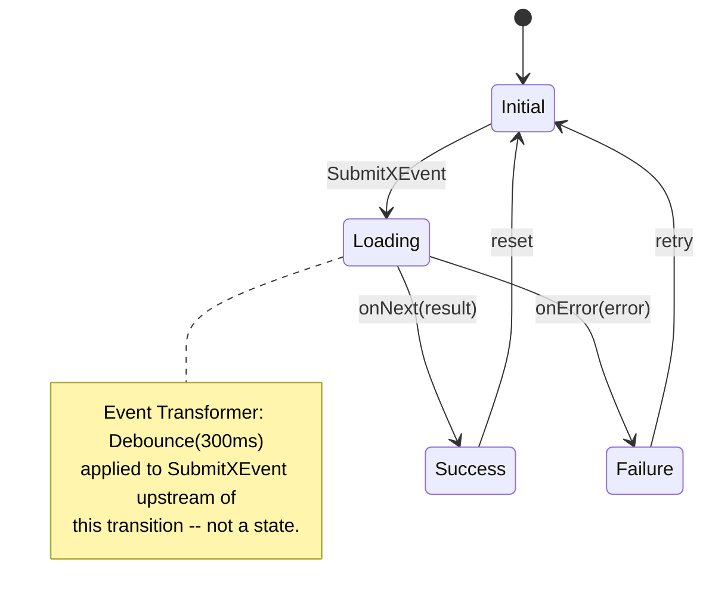

# State Machines + Rule Topology — recipe

**What this is.** The recipe for the per-feature loop's step 4
(`../cognitive-sequence.md`, "State machines + rule topology") — turning a feature's
legacy reactive logic into a Mermaid `stateDiagram-v2` + a truth table. This is the
**output side** of `../extraction-prompt.template.md` (which supplies the dispatch
prompt) and the consuming side of `../rxjava-to-bloc.md` (which supplies the pattern
dictionary used while reading the extraction back). One of the four `spec pendente`
deliverables named in `../../SKILL.md`, "Per-feature loop."

## Input

- **Native route.** The feature's decompiled ViewModel/Presenter/UseCase file(s) — the
  partition slice this deliverable runs against, per the per-feature loop
  (`../../SKILL.md`, "Per-feature loop"). RxJava chains or Coroutine `try/catch` live
  here.
- **WebView route.** The SPA's JS, readable in devtools (source maps if shipped) — no
  ViewModel exists in this case. The state machine is recovered from client-side
  validation/formatting/state logic in the SPA, plus whatever the Fetch-tap observes at
  the backend seam (`../cognitive-sequence.md`, "The WebView branch"). Route is decided
  per feature, not once for the app (loop step 1) — a feature can route to WebView even
  when the app's native line is clean.
- **Dispatch prompt.** `../extraction-prompt.template.md`'s system + worker prompt pair,
  one dispatch per file (native) or per SPA module (WebView) — `[CÓDIGO FONTE AQUI]`
  takes the actual source.
- **Pattern dictionary.** `../rxjava-to-bloc.md`, consulted while reading the extraction
  pass's output back — it disambiguates what looks like a state from what is only an
  event transformer. Not fed verbatim into the dispatch prompt; it's the synthesizer's
  reference, not the model's.

## Output

`features/<slice>/state-machines.mmd` — one file, two parts, so the diagram and the
rules that govern it never drift apart into separate commits:

1. A `stateDiagram-v2` diagram at the top — mermaid-renderable as-is.
2. A trailing truth table, one row per Event × Guard → State transition, fenced inside
   `%% AGENT:START truth_table` / `%% AGENT:END truth_table` markers — the same
   agent-authored-annotation convention `tools/apk-archaeology/references/c4.template.mmd`
   already uses for content a script can't derive. Every row of the table lines up with a transition already drawn
   above it; the table exists to carry the Guard and the Origin columns the diagram
   arrows have no room for.

## Method

Three mappings, read straight off the extraction pass's output:

1. **Public methods called by the View → Events.** Name them Verb+Noun+Event
   (`SubmitXEvent`), matching the worker prompt's own naming rule.
2. **Reactive emissions back to the View (LiveData/StateFlow/Rx) → States.** Land on the
   four classical buckets first — `Initial`, `Loading`, `Success`, `Failure` — and split
   further only if the legacy code itself branches further (e.g. a distinct
   `Success(cached: true)` emission). Don't invent a finer state than what the emission
   actually carries.
3. **RxJava chains / Coroutine `try/catch` → transitions.** Each operator in the chain is
   either **state-affecting** (`doOnSubscribe`/`doOnNext` → `Loading`; `subscribe(onNext,
   onError)` → the `Success`/`Failure` bifurcation) or a **micro-detail annotation** that
   doesn't add a state but changes how or when a transition fires.

### Micro-details — the "got worse" list

This is what a naive rewrite drops silently, and what users notice first. Cross-reference
`../rxjava-to-bloc.md` row by row — don't re-derive the mapping from scratch:

- **`debounce(N, unit)` → not a state.** Annotate the triggering arrow as
  `Event Transformer (Debounce Nms)` (`../rxjava-to-bloc.md` row 3). Drop this in the
  port and the new screen fires on every keystroke/tap instead of settling — the single
  most common "feels spammier/laggier" complaint.
- **`onErrorResumeNext { Observable.just(CacheState) }` → an error path that resolves to
  `Success(cached)`, not `Failure`** (`../rxjava-to-bloc.md` row 4). Drop this and the
  port shows a hard error screen where the legacy silently served stale data — the
  archetypal "worse than before" regression.
- **Timeout / retry.** Not yet in `../rxjava-to-bloc.md`'s starter set — extend that
  table when one turns up in a real target, per its own caveat; don't add the row
  speculatively here. Same treatment as debounce meanwhile: annotate the arrow, don't
  fabricate a `Retrying` state unless the legacy code itself emits one.

## Origin stamp

Same legend the rest of the skill uses (`tools/apk-archaeology/references/overview.template.md`, `../method.md`): 🟢
recovered from code, anchored `file:line` · 🟡 observed/inferred — engineering inference,
not read at a concrete anchor · ⬜ out of RE reach. Applies per finding (per row of the
truth table), not once for the whole diagram:

- A transition read straight off a `.subscribe(...)` call → 🟢, cite the `file:line`.
- A state name inferred because the sealed class wasn't fully readable but the pattern is
  unambiguous → 🟡.
- A WebView interior the SPA hides behind a login wall, not yet reached by the Fetch-tap
  → ⬜. Per `../cognitive-sequence.md`'s WebView branch, a WebView-routed rule is born
  `blind`, climbs to `observed` once the JS is read, `cross-validated` once traffic is
  captured, `business-ratified` only once PO signs — don't stamp a row past what the
  branch has actually reached.

## Consumer

- **Dev (BLoC/Riverpod).** Implements the BLoC/notifier directly from the diagram:
  states → a sealed union (Freezed), events → the `on<Event>` handlers, transitions →
  the handler bodies, micro-detail annotations → the actual debounce timer or
  Stream transformer in the Dart implementation. The diagram is not documentation of the
  target — it *is* the spec the Flutter code gets written against.
- **PO.** Reads the truth table, not the diagram — the Guard column is where
  `preserve | fix | redesign | remove` (loop step 5) gets decided per rule. A debounce or
  a cache-fallback the PO didn't know existed is exactly the finding that needs a named
  owner before it can leave `needs-decision`.

## Worked example

Legacy (Kotlin, RxJava) — a generic `SubmitXViewModel.kt`:

```kotlin
class SubmitXViewModel(private val repository: XRepository) {
    private val state = MutableLiveData<SubmitXState>()
    val stateLiveData: LiveData<SubmitXState> = state

    private val submitSubject = PublishSubject.create<String>()

    init {
        submitSubject
            .debounce(300, TimeUnit.MILLISECONDS)
            .doOnNext { state.postValue(SubmitXState.Loading) }
            .switchMapSingle { input -> repository.submitX(input) }
            .subscribe(
                { result -> state.postValue(SubmitXState.Success(result)) },
                { error -> state.postValue(SubmitXState.Failure(error)) }
            )
    }

    fun onSubmitX(input: String) = submitSubject.onNext(input)
}
```

Extraction output — `features/submit-x/state-machines.mmd`:



```text
%% AGENT:START truth_table
%% | Event                          | Guard / condition                      | From    | To      | Origin |
%% |--------------------------------|------------------------------------------|---------|---------|--------|
%% | SubmitXEvent (debounced 300ms) | repository.submitX() completes (onNext) | Loading | Success | 🟢 SubmitXViewModel.kt:13 |
%% | SubmitXEvent (debounced 300ms) | repository.submitX() throws (onError)   | Loading | Failure | 🟢 SubmitXViewModel.kt:14 |
%% AGENT:END truth_table
```

Two rows is the floor, not the ceiling — a real feature's truth table grows one row per
guard the legacy chain actually branches on (cache-fallback, timeout, retry), never one
row per state.
