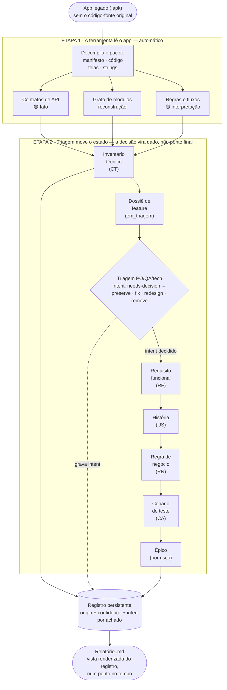

# Relatório — Engenharia Reversa de APK → Backlog

**Projeto/Aplicativo:** [preencher] · **Pacote (`applicationId`):** [preencher] · **Versão do APK / build:** [preencher]
**Autor(a) / Equipe:** [preencher] · **Data:** [preencher]

<!-- Preenchedor: ordem de preenchimento e convenções em references/guia-preenchimento.pt-BR.md. Entregar só este arquivo (.md), não o guia. -->

## 1. Introdução e Objetivo

Este relatório recupera documentação funcional ágil — User Stories (US), Regras de Negócio (RN) e Critérios de Aceite (CA) — a partir do comportamento observado no binário e no código decompilado de um aplicativo Android legado, cada afirmação ancorada em evidência (`arquivo:linha`).

É **insumo para o Product Owner e o time de desenvolvimento**, não um substituto da validação de negócio: o código mostra **como** o sistema foi implementado, não necessariamente como **deveria** funcionar. **Comportamento legado ≠ requisito aprovado** — toda regra recuperada é insumo para o time decidir *manter, mudar, redesenhar ou tirar*, e toda RN inferida é hipótese até ratificação com o negócio.

> *Aplique este método apenas a aplicativos próprios ou com autorização contratual explícita, respeitando termos de uso, licenças e a legislação de proteção de dados (ver §9).*

## 2. Escopo e Limitações

- **Aplicativo / pacote (`applicationId`):** [preencher] · **Versão / build analisado:** [preencher] · **SDK mín./alvo:** [preencher]
- **Módulos/fluxos incluídos no escopo:** [preencher — ex.: login, carrinho, checkout]
- **Módulos/fluxos explicitamente fora do escopo:** [preencher]
- **Status de alcance da extração:** `normal` / `degradado` / `no-go` — [preencher]. Indica se este run perdeu alcance (ofuscação pesada, anti-tamper/pinning, contrato fora do bytecode) além dos pontos cegos listados abaixo; um status `degradado`/`no-go` não invalida o relatório, mas dimensiona quanto dele é extração direta vs. inferência sob limite.

**Limitações conhecidas** (valem para o relatório inteiro):
- **Ofuscação (R8/ProGuard):** nomes ilegíveis — a âncora vira `c/a.java:17` em vez de `LoginActivity.java:178`.
- **Certificate pinning:** pode bloquear a captura na análise dinâmica.
- **Código nativo (`.so`) não decompilado** e **lógica em backend / WebView / remote-config:** rodam fora do binário e ficam invisíveis à leitura estática — viram **ponto cego delimitado** (a análise aponta o limite; a decisão de manter ou nativizar fica com o time).

## 3. Metodologia

O método roda em **dois tempos**: a **Fundação** (uma vez por APK — decompila, classifica + veredito de alcance, grafo de módulos + o *seam*, colheita estática barata) e o **loop por-feature** (sintetiza sobre a fatia de cada feature: contrato/OpenAPI, dicionário de dados, máquinas de estado, `intent`, dossiê, escudo de testes). O relatório abaixo é a vista de decisão desse loop; os insumos concretos que o dev consome estão no §7.

O instalável (`.apk`) entra; a ferramenta produz um extrato técnico com a origem de cada achado marcada; os achados se agregam em **dossiês por feature** (descritivo, decisão pendente); a triagem do time decide o `intent` de cada achado — manter, mudar, redesenhar ou tirar; e só o que já tem `intent` decidido vira documentação de negócio (RF/US/RN/CA). A decisão do time deixa de ser um ponto final em prosa e passa a ser um estado rastreado.



**O registro persistente.** O inventário técnico (CT/RN) não é mais consumido direto por uma esteira que termina no relatório — ele entra num registro persistente onde cada achado carrega **três eixos independentes**: `origin` (de onde veio, estaticamente — 🟢/🟡/⬜, fixo desde que o achado nasceu), `confidence` (`observed` → `cross-validated` → `business-ratified`, o quão confirmado o achado está) e `intent` (`needs-decision` → `preserve`/`fix`/`redesign`/`remove`, a decisão de produto — "manter/mudar/redesenhar/tirar" agora rastreável, não só prosa de relatório). Achados de uma mesma feature se agregam num **dossiê** (descritivo — o que existe, decisão pendente) antes de virar US; o relatório que você está lendo é uma **vista renderizada desse registro num ponto no tempo**.

### 3.1 Análise Estática

Decompila o pacote **sem executá-lo** e extrai, em passos encadeados:

- **Decompilação** — DEX → Java/Smali; manifesto (permissões, activities, intents expostas); layouts XML (telas, campos, textos visíveis); strings, endpoints literais e flags de configuração.
- **Classificação de pacotes** — separa o código do próprio aplicativo das bibliotecas de terceiros, para não tratar código de biblioteca como regra de negócio.
- **Extração de endpoints** — os contratos de API que o app chama (Dimensão *fato*).
- **Grafo de módulos** — como as partes do app dependem umas das outras, base para a ordem de migração (Dimensão *reconstrução*).
- **Síntese de regras e fluxos** — o comportamento de negócio observável, cada afirmação ancorada em `arquivo:linha` (Dimensão *interpretação*).
- **Consolidação** — as três leituras (fato · reconstrução · interpretação) mantidas **sempre separadas**, nunca achatadas.

### 3.2 Análise Dinâmica (opcional — baseada em log)

Quando executada: roda o app num ambiente controlado, dirige os fluxos em escopo, lê os **logs de runtime** (`adb logcat`) e observa o comportamento real — sequência de navegação e busca de config remota no boot. Para a superfície de cada tela, o logcat entrega **sinais** (WebView / Custom-Tab); rotular uma tela como **nativa** vem do dump de hierarquia de views (`uiautomator`, 0 nós WebView), lido por **humano** — logcat não prova ausência. O cruzamento com o extrato estático é a **2ª fonte** de confirmação, feito **à mão** (não há script de reconciliação — ver `references/method.md`). É **comportamento, não tráfego de rede**.

### 3.3 Ferramentas de Referência

| Categoria | Tipo | Finalidade |
|---|---|---|
| Decompilador DEX → Java | Estática | Reconstruir código-fonte legível a partir do bytecode |
| Inspetor de manifesto / recursos | Estática | Ler permissões, activities, layouts e strings |
| Extração de endpoints e grafo (scripts) | Estática | Levantar contratos de API e dependências entre módulos |
| Captura de runtime (`capture_dynamic.sh`: `adb logcat` + `uiautomator`) | Dinâmica | Capturar navegação, sinais de superfície e hierarquia de views durante a navegação |
| `parse_logcat.py` | Dinâmica | Estruturar sequência de navegação e sinais WebView/Custom-Tab; cruzamento com o estático é manual |

> Os scripts específicos do pipeline estão em `SKILL.md`; a spec da análise dinâmica, em `references/method.md`.

## 4. Inventário de Componentes Técnicos (CT)

Lista bruta dos componentes identificados na engenharia reversa, **antes de qualquer interpretação de negócio** — base rastreável para as seções seguintes.

**Três eixos, ortogonais entre si** (não confundir um pelo outro):
- **`origin`** — de onde veio, estaticamente: 🟢 recuperado do código (âncora `arquivo:linha`) · 🟡 inferido (hipótese de engenharia, sem âncora direta) · ⬜ fora do alcance da análise. **Fixo** — fato sobre a extração, não muda depois que o achado nasce.
- **`confidence`** — `observed` (lido só na análise estática) → `cross-validated` (uma 2ª fonte independente do regime estático confirmou — dinâmica ou tráfego) → `business-ratified` (o PO confirmou que o achado é verdadeiro). Sobe conforme a evidência engrossa.
- **`intent`** — `needs-decision` → `preserve` / `fix` / `redesign` / `remove`. A decisão de produto sobre o que fazer com o achado — nunca vem de graça de um 🟢.

Um achado 🟢 (recuperado do código) descreve o comportamento de hoje com fidelidade — não confirma que ele deva continuar; um achado 🟡 (inferido) é hipótese de engenharia até alguém — 2ª fonte ou o PO — confirmar. As três colunas evoluem juntas conforme o achado avança; a tabela abaixo mostra a coluna **Origem** (o eixo fixo).

| ID | Componente | Tipo | Descrição técnica | Evidência (`arquivo:linha`) | Origem |
|---|---|---|---|---|---|
| CT-01 *(exemplo)* | `LoginActivity` | Tela | Autenticação por e-mail/senha; obtém e persiste token de sessão | `LoginActivity.java:178` | 🟢 |
| CT-02 *(exemplo)* | `CartFragment` | Tela | Exibição dos itens do carrinho e cálculo do subtotal | `cart/CartFragment.java:44` | 🟢 |
| CT-03 *(exemplo)* | `DiscountCalculator` | Classe de regra | Cálculo de desconto a partir de um cupom informado | `checkout/DiscountCalculator.java:60` | 🟢 |
| … | [preencher] | [Tela/Fragment/ViewModel/Worker/Classe de regra/API] | [preencher] | `[arquivo:linha]` | 🟢/🟡 |

Uma linha por componente relevante do escopo (§2) — não é preciso listar o app inteiro. Substitua os exemplos pelo inventário real.

## 5. Framework CT → RF → US

### 5.1 Estrutura da User Story

Toda US segue **"Como [persona], quero [ação/capability], para [benefício]"**. A **ação/capability** é recuperada diretamente do fluxo observado (🟢); a **persona** e o **benefício** são inferidos a partir do fluxo de tela (🟡) e o PO confirma. Entre o componente técnico (CT) e a US há o **RF — Requisito Funcional observado**: a frase factual "o app permite X hoje".

**Regra dura — e a trava antes dela.** Uma US só é gerada a partir de um CT/RN cujo `intent` já saiu de `needs-decision` (virou `preserve`, `fix`, `redesign` ou `remove`) — fato recuperado do código não é, por si só, licença para virar história. Essa decisão, por sua vez, não é livre: passa por **3 pré-condições** antes de mover o `intent`:
1. **Mandato** — alguém precisa ter autoridade sobre aquele comportamento; sem dono, o achado fica em `needs-decision`.
2. **Direito legal** — se o comportamento é de plataforma licenciada de terceiro, `preserve`/`fix`/`redesign` pode não ser decisão do cliente: reimplementar pode violar a licença.
3. **Trava LGPD/acessibilidade** — achado que toca dado pessoal/consentimento ou acessibilidade **não vai a `remove`**.

A camada entre o inventário (§4) e a US é o **dossiê de feature** — agrega telas, contratos, regras e telemetria de uma mesma feature num só registro, com status `em_triagem` ou `pronto_para_us`. A triagem (PO/QA/tech) decide o `intent` de cada achado do dossiê; só um dossiê `pronto_para_us` gera US — nunca 1:1 direto do inventário bruto (um dossiê de tela costuma virar de 3 a 5 US testáveis independentes; uma única US gigante é sinal de triagem incompleta).

### 5.2 Tabela de Mapeamento

| ID US | RF observado ("o app permite X hoje") | User Story | CTs | RN |
|---|---|---|---|---|
| US-CART-01 *(exemplo)* | O app permite aplicar um cupom de desconto no carrinho | Como cliente, quero aplicar um cupom, para pagar um valor menor pelo pedido | CT-02, CT-03 | RN-01, RN-02 |
| [preencher] | [preencher] | [preencher] | … | … |

As RN vivem dentro de cada US (§6) — não há catálogo global; a Matriz (§8) é a única vista consolidada, gerada a partir de §6.

## 6. User Stories detalhadas — decisão (PO)

Cada US é desenvolvida por completo dentro da própria seção — já a partir de um dossiê `pronto_para_us` (§5.1). O item "critérios ratificados" da Definition of Ready abaixo é a mesma checagem que `intent ≠ needs-decision` no registro do achado.

**Como nomear e ordenar os épicos — por risco, não por tela.** Migrar tela-por-tela costuma falhar; o valor (ROI) vem de mitigar o maior risco primeiro. Agrupe épicos por **dimensão de risco/valor**, não pela ordem das telas no app:
- **Fundação & Contratos** — DTOs, interceptors, criptografia local, tokens. Libera o desenvolvimento paralelo — o time para de adivinhar o que a API espera.
- **Auth & Sessão** — refresh token, biometria, timeout de sessão. Mitiga o risco de segurança.
- **Domínios de alta fricção** — regras complexas críticas de receita (cálculo financeiro, elegibilidade, gating). Protege a receita.
- **UI/UX (design system)** — UI nativa **não** é engenharia reversa: é construída do zero, o legado serve só de referência de fluxo. Exceção: uma UI **WebView/SPA**, sendo o próprio produto, *é* reconstruída (ponto cego delimitado em §2 — decisão do time nativizar ou manter).

### Épico — [nome, preencher] *(nomeie pela dimensão de risco acima, não por tela — ex. "Fundação & Contratos", não "Tela de Login")*

**Campos de decisão compartilhados** (⬜ — o time preenche; valem para todas as US do épico):
- **Figma / layout-alvo:** não existe no APK legado; o design do app novo é do time de UX.
- **Definition of Ready:** [ ] contexto de negócio (PO) · [ ] Figma aprovado · [ ] critérios ratificados (manter/mudar/redesenhar/tirar — `intent ≠ needs-decision`) · [ ] contrato-alvo definido · [ ] cenários de erro/edge decididos · [ ] estimativa.
- **Definition of Done:** [ ] implementado conforme Figma · [ ] cenários ratificados cobertos por teste · [ ] integração com o backend-alvo · [ ] code review · [ ] PO validou.

#### US-CART-01 — Aplicar cupom de desconto no carrinho *(exemplo — substituir por US real)*

**História.** Como cliente com itens no carrinho, quero aplicar um cupom de desconto, para pagar um valor menor pelo pedido.
*(capability 🟢 ancorada em `DiscountCalculator`; persona e benefício 🟡 — o PO confirma.)*

**Regras de negócio observadas**

| RN | Regra | Evidência | Origem |
|---|---|---|---|
| RN-01 | Desconto só é aplicado se o subtotal atingir o valor mínimo exigido | `DiscountCalculator.java:72` | 🟢 |
| RN-02 | Apenas um cupom pode estar ativo por pedido | `DiscountCalculator.java:88` | 🟡 *(2º cupom não confirmado em tela — a validar)* |

**Critérios de Aceite** (`@legacy-observed` — o PO ratifica antes de virar critério aprovado)

```gherkin
@legacy-observed
Cenário 1 — Cupom válido com subtotal suficiente
  Dado que o subtotal do carrinho é igual ou superior ao valor mínimo
  Quando o cliente insere um cupom válido
  Então o desconto é aplicado e o novo total é exibido      # DiscountCalculator.java:72

Cenário 2 — Subtotal insuficiente
  Dado que o subtotal é inferior ao valor mínimo
  Quando o cliente insere um cupom válido
  Então o sistema informa que o mínimo não foi atingido e o cupom não é aplicado
```

**Cobertura de cenários** (honesta — não achatar)

| Cenário esperado num ticket | Status |
|---|---|
| Caminho feliz (cupom válido + subtotal suficiente) | 🟢 recuperado do código |
| Subtotal insuficiente | 🟢 recuperado do código |
| Segundo cupom / acumulação | 🟡 inferido — não confirmado em tela |
| Cupom expirado / erro de rede | ⬜ fora do alcance — decisão do time |

**Decisões e perguntas abertas.** ⬜ motivação do cupom no produto novo, metas, prioridade · 🟡 validar acumulação de cupons (RN-02) com o negócio.

## 7. Insumos de Implementação — time de dev

Vista de arranque para quem vai construir a migração, consolidada no nível do épico (contrato e dependências são propriedade do fluxo, não de cada US). As âncoras `arquivo:linha` estão em §4.

| US | Contrato recuperado (assinatura + âncora) | Depende de | Sinal de ordem de migração |
|---|---|---|---|
| US-CART-01 *(exemplo)* | `DiscountCalculator.applyCoupon(subtotal, cupom) → {totalComDesconto, valorDesconto}` · `checkout/DiscountCalculator.java:60` | catálogo, autenticação | folha de baixo acoplamento → migra cedo |
| [preencher] | `Classe.metodo(args) → {retorno}` · `[arquivo:linha]` | [preencher] | [fundação de N áreas? folha?] |

> A **arquitetura-alvo** (reusar o backend legado ou construir novo? validação client- ou server-side?) é decisão do time. A ordem final de migração é ratificada pelo time; a coluna acima é direcional, vinda do grafo de módulos (§3.1).

**Deliverables concretos por feature** (receitas em `references/deliverables/`): o contrato recuperado vira **OpenAPI/Swagger v3** (`openapi.md` → `openapi_generator` → DTOs Freezed + cliente Dio); a persistência vira **dicionário de dados** (`persistence.md` → drift/sqflite/shared_preferences/flutter_secure_storage + expiração + flag LGPD); as regras viram **máquinas de estado Mermaid `stateDiagram-v2`** (`state-machines.md` → BLoC/Riverpod); o comportamento decidido (só `preserve`/`fix`) vira **stubs TDD `_test.dart`** (`tdd-stubs.md` — o escudo anti-regressão, que é o DoD); e a **colheita estática** (`harvest.md`: BuildConfig, network-security-config, módulos DI, tokens de `res/values` → `ThemeData`) alimenta a fundação e a leitura de segurança.

## 8. Matriz de Rastreabilidade

Consolida a cadeia completa — **CT → RF → US → RN → CA** — numa única vista, gerada a partir de §6.

| CT | RF | US | RN | CA | Status de cobertura |
|---|---|---|---|---|---|
| CT-02, CT-03 *(exemplo)* | RF-01 | US-CART-01 | RN-01 | Cenário 1, 2 | Confirmado em código **e** em tela |
| CT-03 *(exemplo)* | RF-01 | US-CART-01 | RN-02 | — | Inferido; requer validação com o PO |
| [preencher] | … | … | … | … | [confirmado em código e tela / só código / inferido / requer validação] |

> A distinção "confirmado em código **e** em tela" vs. "só em código" registra a **triangulação** — quando a análise dinâmica (§3.2) serviu de 2ª fonte, diz mais que uma leitura só.

## 9. Escopo de Autorização e Uso Responsável

- Realizar a engenharia reversa **apenas** sobre aplicativos próprios ou com **autorização contratual/documental explícita** do detentor dos direitos.
- Respeitar os termos de uso da loja de distribuição, as licenças de bibliotecas de terceiros embutidas e a legislação de propriedade intelectual aplicável.
- Tratar dados pessoais eventualmente expostos durante a análise conforme a legislação de proteção de dados vigente (ex.: **LGPD**), evitando exposição desnecessária no relatório final.
- **Toda RN reconstruída é hipótese até validação formal** com o negócio ou PO — inclusive as marcadas 🟢, fiéis ao código, não necessariamente ao comportamento correto ou desejado.

## 10. Anexos — Glossário

| Termo | Definição |
|---|---|
| **CT** | Componente Técnico — item bruto do inventário (tela, fragment, viewmodel, worker, classe de regra, endpoint). |
| **RF** | Requisito Funcional observado — "o app permite X hoje"; ponte entre o CT e a US. |
| **US** | User Story — "Como/quero/para" derivada do RF. |
| **RN** | Regra de Negócio — condição, gatilho, cálculo ou validação observada; numerada dentro de cada US. |
| **CA** | Critério de Aceite — cenário testável em Gherkin (`@legacy-observed`), aninhado na US. |
| **Ponto cego** | Comportamento que roda fora do alcance da análise (WebView, backend, remote-config) — delimitado, nunca preenchido por suposição. |
| **`origin`** | Eixo fixo — de onde o achado veio na leitura estática (🟢 recuperado do código / 🟡 inferido / ⬜ fora do alcance). Não muda depois que o achado nasce. |
| **`confidence`** | Eixo que sobe conforme a evidência engrossa: `observed` (só estática) → `cross-validated` (2ª fonte independente) → `business-ratified` (PO confirmou). |
| **`intent`** | Eixo da decisão de produto: `needs-decision` → `preserve` (manter) / `fix` (mudar a implementação, manter a intenção) / `redesign` (divergir do legado de propósito) / `remove` (tirar). |
| **Dossiê de feature** | Agregação descritiva de telas + contratos + regras + telemetria de uma feature, status `em_triagem`/`pronto_para_us` — camada entre o inventário (§4) e a US (§5–6). |
