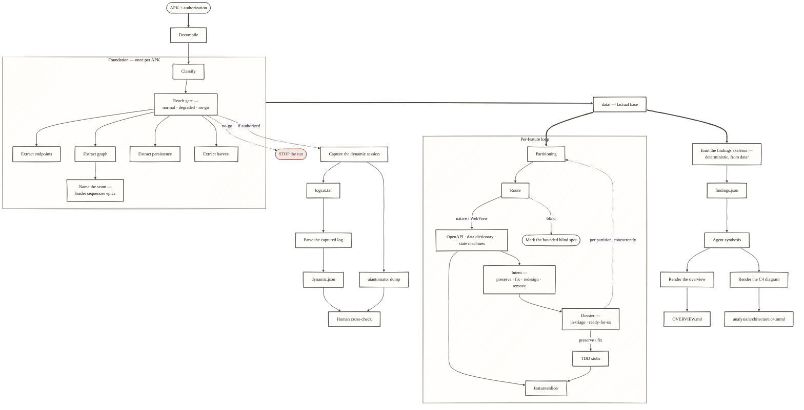

# Workflow — visual map

Illustrative only. A hand-drawn-style diagram of the whole flow: **Foundation** (once
per APK, through the reach gate's `normal / degraded / no-go` verdict — boxed not
because it repeats but so the four extract steps stay adjacent and feed `data/` as one
edge instead of four converging ones) → `data/` as the shared factual base — the one
artifact read by both halves downstream → the **per-feature loop** (boxed because it
is the only part that repeats — dispatched per partition, drawn left-to-right as a
band) → the **output backbone** (flat: deterministic skeleton, then agent synthesis,
then renderers) → the **dynamic pass** (v2 — optional, gated, the dotted `if
authorized` branch). Named file artifacts hang off the step that
produces them, at the same visual weight as everything else — nothing here overrides
the prose in `SKILL.md`, `method.md`, or `cognitive-sequence.md`.

**Known gaps this diagram cannot resolve visually** — hold these in mind whenever
reading it; they are the places it is most likely to mislead if taken at face value:

- **Feature ≠ partition** — the subgraph is named "Per-feature loop" (the method's own
  name for the phase), but its re-dispatch edge says "per partition": that tension is
  the *open design gap* per `cognitive-sequence.md`, "Feature ≠ partition — `spec
  pendente`". The loop dispatches per **partition** (mechanical, package-prefix), not
  per migration **feature** — the feature→slice join is unsolved; don't read the loop
  as one iteration per feature.
- **Per-feature-loop deliverables are spec'd, not yet exercised.** OpenAPI, data
  dictionary, state machines, and TDD stubs have a recipe but no real-run mileage yet,
  unlike Foundation's extract scripts (persistence and harvest are explicitly "built,
  selftest-passing, corpus-validated" per `SKILL.md`; endpoints and graph share the
  same script+selftest discipline). The diagram draws all steps at the same weight —
  maturity is stated here, not encoded visually.
- **The output backbone is not purely mechanical.** Between `findings.json`'s
  deterministic skeleton and the renderers sits an agent-synthesis step — drawn as its
  own node — that fills `verdict`, `migration_shape`, `blind_spots`, `next_steps`,
  `caveats`, and the `bridge_*` metrics: `findings.schema.json` tags these fields
  `synthesized`/`mixed`, and `SKILL.md` warns never to present them as mechanically
  verified fact.
- **Intent/Dossier ordering varies by document.** This diagram sequences Intent →
  Dossier, matching `SKILL.md`'s numbered per-feature-loop steps (5 → 6). The
  client-report flowchart in
  `tools/apk-archaeology/references/modelo-relatorio.pt-BR.md` (§3 Metodologia,
  diagram subgraph "ETAPA 2") sequences Dossiê (`DOS`) → Triagem (`TRI`, where
  `intent` is decided) — the opposite order. Both are accurate to their own
  document; the variance is named here, not resolved — reconciling the two is a
  separate decision the operator has not made.
- **The four extract steps have different classify-scopes** the diagram does not
  differentiate: endpoints runs over `business-candidate ∪ unclassifiable`; graph and
  persistence over `business-candidate` only; harvest is not classify-filtered at all
  (`SKILL.md`, Foundation steps 3–6).
- **The reach gate's verdict is three-valued** — the node names `normal · degraded ·
  no-go`, but the edges still draw only the stop/proceed fork: a `degraded` run
  proceeds with bounded claims, it is not `normal` (`method.md`, "The reach gate").
- **The dynamic pass never yields a "native" verdict by itself.** `parse_logcat.py`
  emits SIGNALS, never a verdict — only the `uiautomator` dump (0 `WebView` nodes),
  read by a human, can support a "native" call; and the cross-check against the static
  bands is a human step by design, with no auto-reconcile (`method.md`, "Dynamic
  analysis (v2)"). Likewise the loop's `blind` route terminates where it is drawn — no
  synthesis pipeline runs for it, honesty instead of a contract
  (`cognitive-sequence.md`, per-feature loop step 1).

Self-critique is deliberately **not** a node in this diagram — it lives in the
per-contract honesty stamps (🟢/🟡/⬜) and the confidence ladder (`blind → observed →
cross-validated → business-ratified`) described in the deliverable recipes, not as a
step of its own.

> Rendering note: `look: handDrawn` needs Mermaid ≥ v10.5 and the YAML frontmatter
> config form above (not the older `%%{init: {...}}%%` pseudo-JSON, which silently
> drops the setting if any value has mixed quoting). Editors/extensions bundling an
> older Mermaid core will render this as a plain (non-sketchy) flowchart — the diagram
> is still correct, just not hand-drawn.
